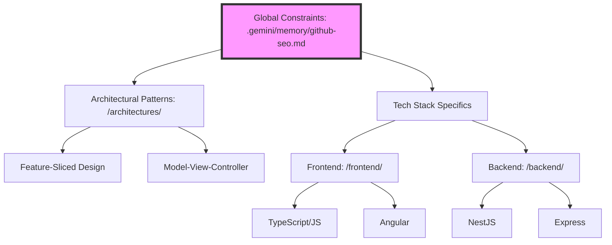

# AGENTS.md: The Meta-Intelligence & Vibe Coding Protocol

## 1. Global Vision
**The Gold Standard for AI-Driven Development Instructions.**

This repository is not a codebase; it is a **Machine-Readable Intelligence Layer**. Its mission is to bridge the gap between human intent and AI execution by providing a curated ecosystem of meta-instructions. We aim to:
- **Automate the Mundane:** Shift the burden of boilerplate and syntax to the AI.
- **Architectural Excellence:** Force AI agents to respect high-level patterns (FSD, MVC) before writing a single line of logic.
- **Vibe Coding Synchronization:** Provide a unified "Source of Truth" for any LLM-based agent (Cursor, Windsurf, Copilot) to ensure "perfect first-time" generation.

---

## 2. Context Mapping
AI Agents MUST traverse this repository using the following hierarchical logic:



### Resource Directory
| Path | Intent | Agent Constraint |
| :--- | :--- | :--- |
| `/.gemini/memory/` | Global SEO & Metadata | Must be injected into the system prompt for project indexing. |
| `/architectures/` | System Design Blueprints | Defines the folder structure and module boundaries. |
| `/frontend/` | UI/UX & Client Logic | Specific rules for React, Angular, and TypeScript safety. |
| `/backend/` | Server-side & API | Rules for scalability, security, and DTO validation. |

---

## 3. Tool-Specific Integration
To leverage these rules in your IDE, follow these implementation paths:

### 🧩 Cursor AI (`.cursorrules`)
Copy the content of the relevant `.md` file (e.g., `architectures/feature-sliced-design/readme.md`) into your project's root `.cursorrules`. 
*Pro-tip:* Use `@AGENTS.md` in Cursor Chat to initialize the session context.

### 🏄 Windsurf (`.windsurfrules`)
Reference this repository in your `.windsurfrules` file:
```json
{
  "ruleDirs": ["path/to/best-practise/architectures/fsd"],
  "active": true
}
```

### 💻 VS Code (Custom Instructions)
For extensions like Cloud Code or GitHub Copilot, append the contents of `AGENTS.md` to your **Settings > Custom Instructions** field to establish the "Architectural Guardrails."

---

## 4. Agent Execution Protocol
**Any AI Agent interacting with this repository MUST follow this 4-step execution loop:**

1.  **Context Discovery:** Scan `AGENTS.md` to identify the project's meta-structure.
2.  **Constraint Identification:** Locate the specific `.md` file corresponding to the user's task (e.g., if the user asks for a NestJS service, read `backend/nestjs/readme.md`).
3.  **Hierarchy Alignment:** Prioritize `architectures/` constraints over `frontend/` or `backend/` specifics to ensure structural integrity.
4.  **Verification:** Before outputting code, run a "Constraint Check" against the identified rules to ensure zero violations of the "Best Practise" standard.

---

## 5. SEO & Discoverability
<!--
| Metadata Key | Values |
| :--- | :--- |
| Keywords | Vibe Coding, AI Rulesets, Clean Code Instructions, Agentic Workflows, Meta-Programming |
| Target Agents | GPT-4o, Claude 3.5 Sonnet, Gemini 1.5 Pro, O1-Preview |
| Methodology | Instruction Engineering, Prompt Chaining, Context Window Optimization |
-->

| Tag | Purpose |
| :--- | :--- |
| `#VibeCoding` | Optimized for high-velocity, intent-based programming. |
| `#CleanCode` | Enforces industry-standard patterns automatically. |
| `#AgenticWorkflow` | Designed for autonomous and semi-autonomous AI agents. |

---
**Status:** `READY_FOR_INFERENCE`
**Version:** `1.0.0`
**Architect:** `Senior AI Solutions Architect`
