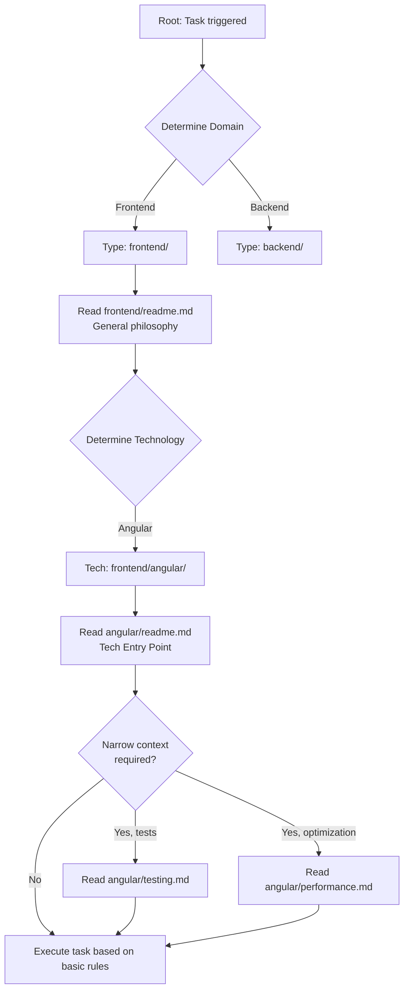

# Project Architecture: Context Deep-Dive

This document outlines the architectural pattern of the meta-instruction base repository (Vibe Coding). The architecture is built on the "Context Deep-Dive" principle (from general to specific), ensuring predictable navigation for both developers and AI agents.

## 1. Directory Hierarchy (The Taxonomy)

The project uses a strict three-level structure: `[Root] -> [Type of Technology] -> [Technology]`.

| Level | Description | Examples |
| :--- | :--- | :--- |
| **`[Root]`** | Repository root. Contains the global configuration and architectural rules (this file). | `/` |
| **`[Type of Technology]`** | Domain categorization. Groups technologies based on their role in the system. | `frontend/`, `backend/`, `security/`, `devops/` |
| **`[Technology]`** | A specific tool, framework, or methodology. Acts as a container for instruction sets. | `frontend/angular/`, `backend/mongodb/`, `architecture/fsd/` |

## 2. Role of `readme.md` (Entry Points)

The `readme.md` files act as Entry Points for AI agents at various hierarchy levels:

* **`[Type of Technology]` Level (Domain):**
  The `readme.md` at this level explains the general philosophy and standards of the layer.
  *(Example: `security/readme.md` describes fundamental security principles applicable to all tools within).*
* **`[Technology]` Level (Tool):**
  The `readme.md` here is the primary entry point for a specific technology. It contains basic, global rules applied by default when working with this technology.

## 3. Specific Modules (Specific `.md` files)

To prevent the main technology `readme.md` from becoming overloaded, detailed instructions are extracted into isolated specific modules.

**Creation Rules:**
1. The file is created within the `[Technology]` folder.
2. The filename must reflect a narrow context (e.g., `performance.md`, `testing.md`, `naming-convention.md`).
3. The module must be entirely focused on its stated topic. The AI agent will only include this file when the task overlaps with this specific context.

## 4. AI Agent Path (Visualization)

Below is a diagram of the AI agent's navigation when searching for context for a task:

## 5. Rules for Adding New Technologies

When adding a new technology, contributors must follow this algorithm:

1. **Localization:** Determine the appropriate `[Type of Technology]` domain. If it does not exist, create it and add a domain `readme.md` detailing its philosophy.
2. **Setup Container:** Create the technology directory: `[Type of Technology]/[Technology]/`.
3. **Initialize Entry Point:** Create the mandatory `[Technology]/readme.md` file with foundational rules and standards.
4. **Decomposition (if necessary):** If the rules are too extensive, separate narrow aspects (testing, security, performance) into standalone files (e.g., `security.md`).
5. **Linking (optional):** Mention the existence of specific modules in the main technology `readme.md` to improve AI agent indexing.