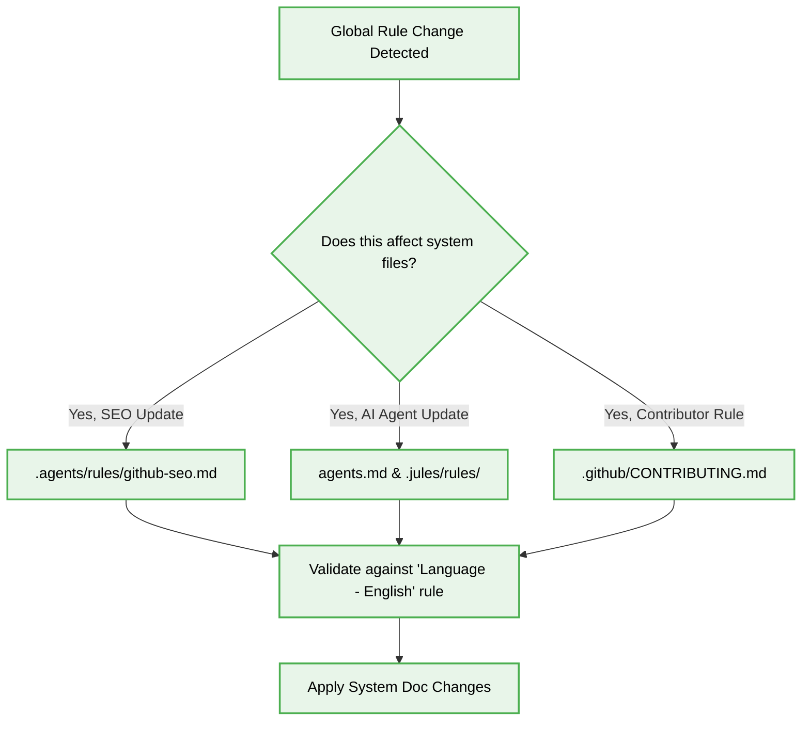

# ⚙️ System Documentation & AI Quality Rules for Jules

## 1. Context & Scope
- **Primary Goal:** Ensure the continuous improvement and high **documentation quality** of the core system files that guide developers and AI agents.
- **Target Tooling:** Jules AI agent (Vibe Coding, Automated Maintenance).
- **Target Scope:** Core repository standards and AI instruction sets.

  

  **Maintaining the Machine-Readable Intelligence Layer of the repository.**

---

## 2. Core System Files and Directories

> [!WARNING]
> **System Integrity:** Modifying these files impacts the entire behavior of AI assistants and the structural integrity of the repository. Jules must ensure absolute alignment with existing architectural boundaries when altering these files.

These are the protected, systemic layers where **vibe coding** rules and project governance reside.

### System Directories to Maintain
| Directory | Responsibility | Jules Action Required |
| :--- | :--- | :--- |
| `/.github/` | Contributor facing documentation | Keep community guidelines and automation templates updated. |
| `/.agents/rules/` | Global agent constraints | Maintain architectural logic and SEO rules (`github-seo.md`). |
| `/.jules/rules/` | Jules-specific operational rules | Refine execution protocols to reduce agent hallucinations. |
| `/.gemini/commands/gen/` | Prompt generation commands | Ensure code generation prompts remain strict and typed. |
| `/.gemini/memory/` | Global context retention | Update with the latest project architectural shifts. |

### Essential Files Definition
The following files are systemic for promoting high **documentation quality** and smooth AI-Assistant operation:
- `README.md` – The entry point for developers and AI agents.
- `.github/CONTRIBUTING.md` & `.github/CODE_OF_CONDUCT.md` – Project collaboration rules.
- `agents.md` – The primary meta-intelligence protocol defining how AI agents operate.
- `.agents/rules/github-seo.md` – Search Engine Optimization and metadata structures.
- `.agents/rules/project-architecture.md` – Core architectural constraints.
- `.agents/rules/rules.md` & `.agents/rules/system-markdown.md` – Specific constraints enforcing clean code and high documentation searchability.

---

## 3. Maintenance Protocol for Jules

Jules must actively sync these files whenever a new global rule is adopted.

---

## 4. Documentation Quality Standards

When writing or updating **system documentation**, Jules must verify the following constraints:
- [ ] **Technical Easy English:** Ensure all additions use simple, professional English without slang or jargon (or provide explanations for technical terms if required).
- [ ] **Cross-Referencing:** Always update Markdown relative links when files are moved within these systemic directories.
- [ ] **Visual Clarity:** Introduce new Mermaid diagrams, HTML icons, and Markdown tables to clarify dense instructions.
- [ ] **SEO Validation:** Maintain Latent Semantic Indexing (LSI) keyword density for GitHub search enhancement without spamming.
