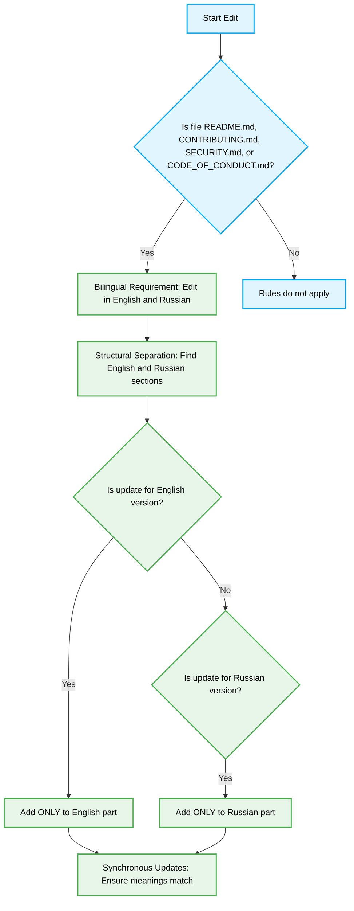

---
trigger: glob
description: Rules for making changes to system Markdown files in 2 languages (English/Russian).
globs: "{README.md,.github/CONTRIBUTING.md,.github/SECURITY.md,.github/CODE_OF_CONDUCT.md}"
technology: Vibe Coding
domain: Documentation
level: Senior/Architect
version: Latest
tags: [vibe-coding, documentation, best-practices, architecture]
ai_role: Senior Vibe Coding Expert
last_updated: 2026-03-29
topic: Vibe Coding
complexity: Architect
last_evolution: 2026-03-29
vibe_coding_ready: true---

# System Markdown Files Formatting
## Applicability
These rules apply STRICTLY and EXCLUSIVELY to the following files:
- `README.md`
- `.github/CONTRIBUTING.md`
- `.github/SECURITY.md`
- `.github/CODE_OF_CONDUCT.md`

The glob pattern is configured so that it does not affect any other Markdown files in the project.
## Core Editing Rules

1. **Bilingual Requirement**:
   Any change (addition, modification, or deletion of text) must be done in both languages: English and Russian.

2. **Structural Separation**:
   Each of these files must be explicitly visually and structurally divided into 2 parts (sections):
   - English part (for example, the `English` section)
   - Russian part (for example, the `Русский` section)

3. **Synchronous Updates**:
   During any modification or addition of new items, every change must be placed strictly in its respective language section:
   - Updates for the English version are added ONLY to the English part.
   - Updates for the Russian version are added ONLY to the Russian part.

*Ensure that both parts remain synchronized in meaning and logic; do not leave an item in only one language.*

