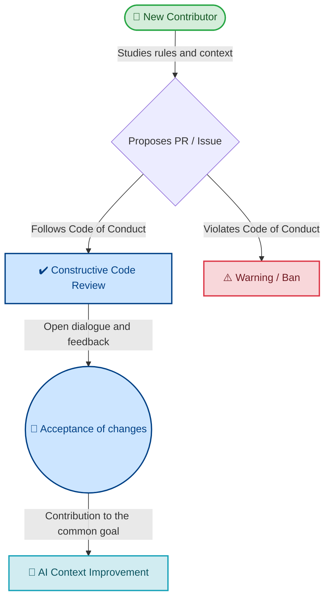
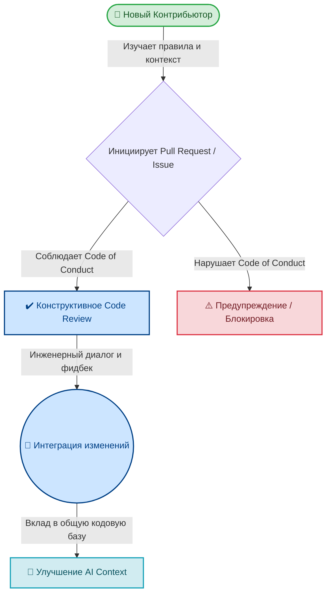

<div align="center"></div>
[🇺🇸 English](#english) | [🇷🇺 Русский](#russian)

<a id="english"></a>

<div align="center">
  
  
  # Community Code of Conduct
  
  [](https://www.contributor-covenant.org/version/2/1/code_of_conduct/)
  [](#)
  [](#)

  **Building the best codebase for AI agents together in a respectful and inclusive environment.**
</div>

---

## 🌟 Our Pledge

In the interest of fostering an open, welcoming, and safe environment, we as contributors and maintainers of the **best-practise** project pledge to make participation in our project and our community a harassment-free experience for everyone, regardless of age, body size, visible or invisible disability, ethnicity, sex characteristics, gender identity and expression, level of experience, education, socio-economic status, nationality, personal appearance, race, caste, color, religion, or sexual orientation.

We pledge to act and interact in ways that contribute to an open, welcoming, diverse, inclusive, and healthy community.

---

## ⚖️ Our Standards

In our repository dedicated to *Vibe Coding* and architectural AI instructions, we value constructive dialogue and professionalism.

| 🟢 Awesome Behavior | 🔴 Unacceptable Behavior |
|:---|:---|
| 🫱🏼‍🫲🏾 Using welcoming and inclusive language. | 🤬 The use of sexualized language or imagery. |
| 🤝 Being respectful of differing viewpoints and developer experiences. | 🧌 Trolling, insulting/derogatory comments, and personal or political attacks. |
| 💡 Gracefully accepting constructive criticism on code or rules. | 🛑 Public or private harassment of project members. |
| 🌍 Focusing on what is best for the community and accommodating for programming beginners. | 📢 Publishing others' private information without explicit permission. |
| 🧠 Sharing knowledge and experience in development and AI architecture. | 🚫 Other conduct which could reasonably be considered inappropriate in a professional setting. |

---

##  Interaction Lifecycle

Interaction within the **best-practise** project is built on mutual respect and continuous improvement of AI instructions. This visual graph demonstrates the stages of healthy communication in the project:



---

## 📝 How to Write Instructions (Best Practices)

In our repository, we adhere to a unified standard for writing instructions. You can study the `frontend/typescript/readme.md` file as a reference example.

Each instruction must begin with the following metadata block (YAML frontmatter):

```yaml
---
technology: [Inferred Tech]
domain: [Inferred Domain]
level: Senior/Architect
version: [Inferred Version]
tags: [tag1, tag2, tag3]
ai_role: [Specific Persona]
last_updated: YYYY-MM-DD
---
```

Next, to describe each rule or pattern, you should use the following structure. **This structure is repeated as many times as necessary** to fully cover the topic. Here is one of the clearest and most popular examples:

### ❌ Bad Practice
```typescript
function process(data: any) {
    console.log(data.name); // No error, but can fail at runtime
}
```

### ⚠️ Problem
Using `any` is equivalent to disabling TypeScript. It allows the code to compile in any case, but hides potential runtime exceptions.

### ✅ Best Practice
```typescript
function process(data: unknown) {
    if (data && typeof data === 'object' && 'name' in data) {
        console.log((data as { name: string }).name);
    }
}
```

### 🚀 Solution
Use `unknown` for values whose type is not yet determined. This obliges the developer to perform a type check before use, ensuring the safety of the data structure.

---

## 🛡️ Our Responsibilities

Project maintainers, including the project founder **Jamoliddin Qodirov**, are responsible for clarifying the standards of acceptable behavior and are expected to take appropriate and fair corrective action in response to any instances of unacceptable behavior.

Project maintainers have the right and responsibility to remove, edit, or reject comments, commits, code, wiki edits, issues, and other contributions (including AI instructions) that are not aligned with this Code of Conduct. Maintainers are also expected to explain the reasons for their moderation decisions when removing content or issuing bans.

---

## 🌐 Scope

This Code of Conduct applies in the following scenarios:
1. Within all **best-practise** project spaces (including the GitHub repository, branches, issue discussions, and pull request comments).
2. In public spaces when an individual is representing the project or its community. Examples include using an official project e-mail address, posting via an official social media account, or acting as an appointed representative at an online or offline event.

---

## 🚨 Enforcement

Instances of abusive, harassing, or otherwise unacceptable behavior may be reported to the project maintainers:

- 📧 **Communication Method:** Please reach out directly to the project maintainers (via open issues for moderation, private messages, or public contacts found on their GitHub profiles).

All complaints will be reviewed and investigated promptly, fairly, and impartially. Project maintainers are obligated to maintain confidentiality with regard to the reporter of an incident.

### Enforcement Guidelines

Project maintainers will follow these Community Impact Guidelines in determining the consequences for any action they deem in violation of this Code of Conduct:

1. **Correction:** A private, written warning from the maintainers, providing clarity around the nature of the violation and an explanation of why the behavior was inappropriate. A public apology may be requested.
2. **Warning:** A warning with consequences, such as a temporary suspension from communicating in the project or a ban on interacting with specific individuals for a set period.
3. **Temporary Ban:** A temporary ban from any interaction with the project, including creating issues and pull requests.
4. **Permanent Ban:** A complete and permanent ban from any sort of public interaction within the project for systematic, intentional, or severe violations (e.g., harassment or threats).

---

## 📜 Attribution

This Code of Conduct is adapted from the [Contributor Covenant](https://www.contributor-covenant.org), version 2.1, available at [https://www.contributor-covenant.org/version/2/1/code_of_conduct.html](https://www.contributor-covenant.org/version/2/1/code_of_conduct.html).

Answers to common questions about this code of conduct can be found in the official [FAQ](https://www.contributor-covenant.org/faq). Translations are available at [https://www.contributor-covenant.org/translations](https://www.contributor-covenant.org/translations).

---

<a name="russian"></a>

<div align="center">
  
  
  # Community Code of Conduct
  
  [](https://www.contributor-covenant.org/version/2/1/code_of_conduct/)
  [](#)
  [](#)

  **Проектирование детерминированной кодовой базы для ИИ-агентов в условиях архитектурной целостности и взаимоуважения.**
</div>

---

## 🌟 Наши Обязательства

В целях поддержания надежной и безопасной среды разработки, контрибьюторы и мейнтейнеры **best-practise** обязуются обеспечивать рабочую атмосферу, свободную от харассмента. Правило распространяется на всех участников, независимо от возраста, уровня инженерной подготовки, гендерной или этнической принадлежности, инвалидности, внешности, религии и социо-экономического статуса.

Мы гарантируем следование принципам инклюзивного, профессионального и технологически сфокусированного инженерного комьюнити.

---

## ⚖️ Стандарты Взаимодействия

В репозитории, ядром которого выступают *Vibe Coding* и строгие архитектурные ИИ-инструкции, фундаментальным приоритетом является конструктивный инженерный диалог.

| 🟢 Допустимое поведение | 🔴 Недопустимое поведение |
|:---|:---|
| 🫱🏼‍🫲🏾 Использование инклюзивной и технологически корректной терминологии. | 🤬 Использование сексуализированного контента или лексики. |
| 🤝 Уважение разницы в опыте и альтернативных технических парадигм разработчиков. | 🧌 Троллинг, переход на личности, обсуждение политики или неконструктивные (Toxic) дискуссии. |
| 💡 Профессиональная обработка обратной связи в рамках Code Review и обсуждения архитектуры. | 🛑 Харассмент мейнтейнеров или участников проекта. |
| 🌍 Фокус на архитектурной целостности системы и адаптации контекста для начинающих. | 📢 Деанонимизация (Doxing) и публикация приватных данных без явного согласия. |
| 🧠 Распространение паттернов разработки и экспертизы в AI Context Engineering. | 🚫 Любой паттерн поведения, нарушающий стандарты профессиональной этики. |

---

## Жизненный Цикл Взаимодействия

Жизненный цикл интеграции в **best-practise** базируется на взаимоуважении и детерминированном подходе к улучшению ИИ-инструкций (AI Context Injection). Архитектура здоровой коммуникации описана ниже:



---

## 📝 Форматирование Инструкций (Best Practices)

В репозитории утвержден строгий архитектурный стандарт формирования ИИ-инструкций. В качестве эталонной имплементации (Reference Implementation) изучите `frontend/typescript/readme.md`.

Каждый документ обязан внедрять метаданные (YAML frontmatter) для маршрутизации контекста:

```yaml
---
technology: [Inferred Tech]
domain: [Inferred Domain]
level: Senior/Architect
version: [Inferred Version]
tags: [tag1, tag2, tag3]
ai_role: [Specific Persona]
last_updated: YYYY-MM-DD
---
```

Для документирования каждого паттерна или Constraints (Ограничения) применяется следующий регламент. **Паттерн тиражируется столько раз, сколько необходимо** для покрытия домена. Пример стандартизации типов:

### ❌ Bad Practice
```typescript
function process(data: any) {
    console.log(data.name); // Отсутствие статического анализа, риск Runtime Exception
}
```

### ⚠️ Problem
Внедрение `any` деактивирует type-checking в TypeScript. Пропускает потенциальные ошибки на этапе компиляции, генерируя уязвимости и Hallucinations (Галлюцинации) в рантайме.

### ✅ Best Practice
```typescript
function process(data: unknown) {
    if (data && typeof data === 'object' && 'name' in data) {
        console.log((data as { name: string }).name);
    }
}
```

### 🚀 Solution
Имплементация `unknown` для нетипизированных структур данных форсирует явные проверки типов (Type Guards). Подход гарантирует детерминированную валидацию контракта.

---

## 🛡️ Зона Ответственности

Мейнтейнеры проекта, включая системного архитектора **Jamoliddin Qodirov**, несут ответственность за поддержание стандартов инженерной культуры. Они обязаны применять соразмерные корректирующие протоколы в случае инцидентов.

Команда обладает эксклюзивной авторизацией на удаление, ревью и блокировку комментариев, коммитов, веток (Branches), участков кода и артефактов (включая инструкции), противоречащих Code of Conduct. Мейнтейнеры аргументируют архитектурные и модерационные решения при вынесении банов.

---

## 🌐 Scope (Область Действия)

Регламент валиден в следующих контурах:
1. Во всем пространстве **best-practise** (репозиторий GitHub, Branches, Issues, Pull Requests).
2. В публичном поле при позиционировании лица как представителя проекта. Включая использование официальных e-mail, публикацию через корпоративные аккаунты или присутствие на отраслевых ивентах.

---

## 🚨 Модерация и Санкции

При детекции харассмента, токсичного поведения или иных инцидентов инициируйте эскалацию:

- 📧 **Канал эскалации:** Прямое обращение к мейнтейнерам напрямую через Issues, приватные сообщения или публичные контакты в профиле GitHub.

Инциденты аудируются оперативно, по строгим критериям и беспристрастно. Конфиденциальность репортера гарантируется протоколом.

### Шкала Санкций

При классификации нарушений мейнтейнеры базируются на следующих уровнях Response:

1. **Коррекция (Correction):** Приватное уведомление с констатацией факта нарушения и разъяснением деструктивного паттерна. Допускается требование публичных извинений.
2. **Предупреждение (Warning):** Жесткое предупреждение с временным ограничением прав (например, запрет на коммуникацию в репозитории на N дней).
3. **Временная Блокировка (Temporary Ban):** Заморозка всех прав инженера на взаимодействие с проектом (запрет Pull Requests и Issues).
4. **Перманентная Блокировка (Permanent Ban):** Необратимое отлучение от проекта. Применяется за системные сбои в соблюдении Code of Conduct или критические нарушения (харассмент, доксинг, угрозы безопасности).

---

## 📜 Атрибуция

Спецификация Code of Conduct адаптирована из [Contributor Covenant](https://www.contributor-covenant.org), version 2.1, исходник: [https://www.contributor-covenant.org/version/2/1/code_of_conduct.html](https://www.contributor-covenant.org/version/2/1/code_of_conduct.html).

Ответы на архитектурные и процессные вопросы задокументированы в официальном [FAQ](https://www.contributor-covenant.org/faq). Локализации спецификации доступны на [https://www.contributor-covenant.org/translations](https://www.contributor-covenant.org/translations).
