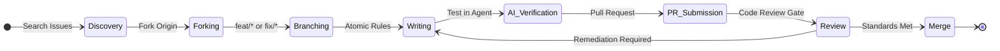

<div align="center">
  
  
  # 👥 Contributing
  
  [](#)
  [](#)
</div>

---

## 🔄 The Contribution Lifecycle

We engineer context. The process of contributing meta-instructions must be as rigorous as the software architectures we define. Follow this lifecycle without deviation.



---

## 🧠 Writing Standards for AI Context (The Spec)

AI Agents (Cursor, Windsurf, Antigravity) do not need conversational prose; they need high-density, analytical directives.

> [!IMPORTANT]
> Eliminate all fluff. Use imperative mood. Maximize token efficiency. Our goal is deterministic "Beautiful Code".

### 📊 Bad Content vs. Good Content

| Quality | Example Content | Why it Matters |
| :---: | :--- | :--- |
| ❌ **BAD** | "Please make sure to try and use functional components if you can, it's usually better." | Conversational, ambiguous ("try and use", "if you can", "usually"). |
| ✅ **GOOD**| "Use React Functional Components exclusively. Class components are strictly prohibited." | Imperative, absolute constraint, deterministic boundary for the LLM. |

### 🛠️ Domain & Technology Tokens

Every instruction must target its exact technical domain. Tag your docs logically:

*  **Frontend**: Frameworks, state management, pure UI architecture.
*  **Backend**: API design, databases, microservices.
*  **Architecture**: CI/CD, deployment strategy, system design.

> [!NOTE]
> **Mermaid Diagrams are Mandatory:** Any architectural pattern, data flow, or state machine rule that involves more than two entities **must** be accompanied by a Mermaid diagram. AI models parse explicit structural limits significantly better when visualized in markdown.

---

## 🚀 Step-by-Step Workflow

Execute your contributions using the following pipeline:

1. 🏗️ **Branching Strategy**:
   * Always branch from `main`.
   * Use strict category prefixes: `feat/tech-name`, `fix/tech-name`, or `docs/tech-name`.
2. ✍️ **Content Guidelines**:
   * Enforce analytical tone. Use Markdown Tables for rulesheets. Use Task Lists for sequential operations.
3. 🧪 **Verification (The Vibe Coding Test)**:
   * **Mandatory**: You must pass the target instruction into Cursor, Windsurf, or Antigravity and verify the output. If the agent generates hallucinated or sub-standard code, the instruction is flawed. Fix it before submitting.

---

## 🏗️ Repository Architecture

Our structure is absolute. We isolate context by domain and technology to prevent AI context pollution.

```text
📂 best-practise
├── 📂 [domain]            (e.g., frontend, backend, devops)
│   └── 📂 [technology]    (e.g., angular, nestjs, docker)
│       ├── 📄 readme.md   (Mandatory: Primary Entry Point & Index)
│       └── 📄 [spec].md   (Granular Constraints, e.g., reactive-forms.md)
```

> [!TIP]
> Do not scatter configuration instructions. If a domain or technology doesn't exist, create it, but it **must** contain a `readme.md`.

---

## 📜 Commit Convention

We run automated semver and changelogs. Unstructured commits break automation and will be rejected. Use [Conventional Commits](https://www.conventionalcommits.org/).

| Type | Description |
| :--- | :--- |
| `feat:` | Creates a new meta-instruction or pattern. |
| `fix:` | Corrects an existing, flawed instruction. |
| `docs:` | Updates global config documents (like this file). |
| `refactor:` | Restructures existing domains/directories. |
| `chore:` | Tooling, formatting, or maintenance tasks. |

**Perfect Commit Example:**
```bash
feat(backend): implement NestJS strategy pattern instructions
```

---

## 🛡️ The Pull Request Gate

Copy and paste this checklist into your PR description. Do not request an architectural review until every box is checked.

```markdown
### PR Quality Gate
- [ ] Follows the absolute `[domain]/[technology]` atomic file structure.
- [ ] Integrates SVG/Devicons to demarcate technology sections.
- [ ] Includes at least one Mermaid diagram for complex constraints/logic.
- [ ] Language is zero-fluff, analytical, and highly technical.
- [ ] Proven via the "Vibe Coding Test" (AI execution output/proof included below).
```

---

*We engineer the intelligence that engineers the code. Execute with precision.*
