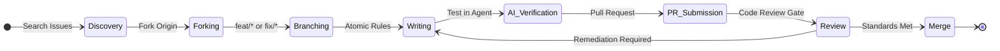

[ 🇺🇸 English ](#english) | [ 🇷🇺 Русский ](#russian)

<a id="english"></a>

<div align="center">
  
  
  # 👥 Contributing
  
  [](#)
  [](#)
</div>

---

## 🔄 The Contribution Lifecycle

We engineer context. The process of contributing meta-instructions must be as rigorous as the software architectures we define. Follow this lifecycle without deviation.



---

## 🧠 Writing Standards for AI Context (The Spec)

AI Agents (Cursor, Windsurf, Antigravity) do not need conversational prose; they need high-density, analytical directives.

> [!IMPORTANT]
> Eliminate all fluff. Use imperative mood. Maximize token efficiency. Our goal is deterministic "Beautiful Code".

### 📊 Bad Content vs. Good Content

| Quality | Example Content | Why it Matters |
| :---: | :--- | :--- |
| ❌ **BAD** | "Please make sure to try and use functional components if you can, it's usually better." | Conversational, ambiguous ("try and use", "if you can", "usually"). |
| ✅ **GOOD**| "Use React Functional Components exclusively. Class components are strictly prohibited." | Imperative, absolute constraint, deterministic boundary for the LLM. |

### 🛠️ Domain & Technology Tokens

Every instruction must target its exact technical domain. Tag your docs logically:

*  **Frontend**: Frameworks, state management, pure UI architecture.
*  **Backend**: API design, databases, microservices.
*  **Architecture**: CI/CD, deployment strategy, system design.

> [!NOTE]
> **Mermaid Diagrams are Mandatory:** Any architectural pattern, data flow, or state machine rule that involves more than two entities **must** be accompanied by a Mermaid diagram. AI models parse explicit structural limits significantly better when visualized in markdown.

---

## 🚀 Step-by-Step Workflow

Execute your contributions using the following pipeline:

1. 🏗️ **Branching Strategy**:
   * Always branch from `main`.
   * Use strict category prefixes: `feat/tech-name`, `fix/tech-name`, or `docs/tech-name`.
2. ✍️ **Content Guidelines**:
   * Enforce analytical tone. Use Markdown Tables for rulesheets. Use Task Lists for sequential operations.
3. 🧪 **Verification (The Vibe Coding Test)**:
   * **Mandatory**: You must pass the target instruction into Cursor, Windsurf, or Antigravity and verify the output. If the agent generates hallucinated or sub-standard code, the instruction is flawed. Fix it before submitting.

---

## 🏗️ Repository Architecture

Our structure is absolute. We isolate context by domain and technology to prevent AI context pollution.

```text
📂 best-practise
├── 📂 [domain]            (e.g., frontend, backend, devops)
│   └── 📂 [technology]    (e.g., angular, nestjs, docker)
│       ├── 📄 readme.md   (Mandatory: Primary Entry Point & Index)
│       └── 📄 [spec].md   (Granular Constraints, e.g., reactive-forms.md)
```

> [!TIP]
> Do not scatter configuration instructions. If a domain or technology doesn't exist, create it, but it **must** contain a `readme.md`.

---

## 📜 Commit Convention

We run automated semver and changelogs. Unstructured commits break automation and will be rejected. Use [Conventional Commits](https://www.conventionalcommits.org/).

| Type | Description |
| :--- | :--- |
| `feat:` | Creates a new meta-instruction or pattern. |
| `fix:` | Corrects an existing, flawed instruction. |
| `docs:` | Updates global config documents (like this file). |
| `refactor:` | Restructures existing domains/directories. |
| `chore:` | Tooling, formatting, or maintenance tasks. |

**Perfect Commit Example:**
```bash
feat(backend): implement NestJS strategy pattern instructions
```

---

## 🛡️ The Pull Request Gate

Copy and paste this checklist into your PR description. Do not request an architectural review until every box is checked.

```markdown
### PR Quality Gate
- [ ] Follows the absolute `[domain]/[technology]` atomic file structure.
- [ ] Integrates SVG/Devicons to demarcate technology sections.
- [ ] Includes at least one Mermaid diagram for complex constraints/logic.
- [ ] Language is zero-fluff, analytical, and highly technical.
- [ ] Proven via the "Vibe Coding Test" (AI execution output/proof included below).
```

---

*We engineer the intelligence that engineers the code. Execute with precision.*

---

<a id="russian"></a>

<div align="center">
  
  
  # 👥 Контрибьютинг (Contributing)
  
  [](#)
  [](#)
</div>

---

## 🔄 Жизненный цикл контрибьютора

Мы проектируем контекст. Процесс внесения мета-инструкций должен быть таким же строгим, как и архитектура программного обеспечения, которую мы определяем. Следуйте этому жизненному циклу без отклонений.

```mermaid
stateDiagram-v2
    direction LR
    [*] --> Discovery: Поиск Issues
    Discovery --> Forking: Форк проекта
    Forking --> Branching: feat/* или fix/*
    Branching --> Writing: Написание атомарных правил
    Writing --> AI_Verification: Тестирование в агенте
    AI_Verification --> PR_Submission: Pull Request
    PR_Submission --> Review: Code Review
    Review --> Merge: Стандарты соблюдены
    Review --> Writing: Требуются исправления
    Merge --> [*]
```



---

## 🧠 Стандарты написания контекста для ИИ (Спецификация)

ИИ-агентам (Cursor, Windsurf, Antigravity) не нужна разговорная проза; им нужны высокоплотные, аналитические директивы.

> [!IMPORTANT]
> Исключите "воду" из текста. Используйте повелительное наклонение. Максимизируйте эффективность токенов. Наша цель — детерминированный "Чистый Код" (Beautiful Code).

### 📊 Плохой и хороший контент

| Качество | Пример контента | Почему это важно |
| :---: | :--- | :--- |
| ❌ **ПЛОХО** | "Пожалуйста, постарайтесь использовать функциональные компоненты, если можете, обычно это лучше." | Разговорный, двусмысленный стиль ("постарайтесь", "если можете", "обычно"). |
| ✅ **ХОРОШО**| "Используйте исключительно функциональные компоненты React. Классовые компоненты строго запрещены." | Императивное, абсолютное ограничение, детерминированная граница для LLM. |

### 🛠️ Домены и теги технологий

Каждая инструкция должна быть нацелена на точный технический домен. Логично размечайте ваши документы:

*  **Frontend**: Фреймворки, управление состоянием, чистая UI-архитектура.
*  **Backend**: Проектирование API, базы данных, микросервисы.
*  **Architecture**: CI/CD, стратегии развертывания, системный дизайн (System Design).

> [!NOTE]
> **Диаграммы Mermaid обязательны:** Любой архитектурный паттерн, поток данных (Data Flow) или правило конечного автомата, включающее более двух сущностей, **обязаны** сопровождаться диаграммой Mermaid. Модели ИИ значительно лучше понимают явные структурные ограничения при их визуализации в Markdown.

---

## 🚀 Пошаговый Workflow (Рабочий процесс)

Вносите свой вклад, используя следующий пайплайн:

1. 🏗️ **Стратегия ветвления (Branching Strategy)**:
   * Всегда создавайте ветки от `main`.
   * Используйте строгие префиксы категорий: `feat/tech-name`, `fix/tech-name` или `docs/tech-name`.
2. ✍️ **Правила оформления контента**:
   * Придерживайтесь аналитического тона. Используйте таблицы Markdown для свода правил. Используйте списки задач (Task Lists) для последовательных операций.
3. 🧪 **Верификация (Vibe Coding Test)**:
   * **Обязательно**: Вы должны передать целевую инструкцию в Cursor, Windsurf или Antigravity и проверить результат. Если агент генерирует галлюцинации или нестандартный код, инструкция ошибочна. Исправьте её перед отправкой (PR).

---

## 🏗️ Архитектура репозитория

Наша структура абсолютна. Мы изолируем контекст по доменам и технологиям, чтобы предотвратить "загрязнение" контекста для ИИ (AI context pollution).

```text
📂 best-practise
├── 📂 [домен]             (например, frontend, backend, devops)
│   └── 📂 [технология]    (например, angular, nestjs, docker)
│       ├── 📄 readme.md   (Обязательно: Основная точка входа и Индекс)
│       └── 📄 [spec].md   (Гранулярные ограничения, например, reactive-forms.md)
```

> [!TIP]
> Не разбрасывайте инструкции по настройке. Если домен или технология еще не существует, создайте их, но в директории **обязан** быть файл `readme.md`.

---

## 📜 Соглашения о коммитах (Commit Convention)

Мы используем автоматизированное семантическое версионирование (semver) и генерацию Changelog. Неструктурированные коммиты ломают автоматизацию и будут отклонены. Используйте [Conventional Commits](https://www.conventionalcommits.org/).

| Тип | Описание |
| :--- | :--- |
| `feat:` | Создает новую мета-инструкцию или паттерн. |
| `fix:` | Исправляет существующую, ошибочную инструкцию. |
| `docs:` | Обновляет глобальные документы конфигурации (подобно этому файлу). |
| `refactor:` | Реструктурирует существующие домены/директории. |
| `chore:` | Инструментарий, форматирование или задачи обслуживания. |

**Пример идеального коммита:**
```bash
feat(backend): implement NestJS strategy pattern instructions
```

---

## 🛡️ Врата Pull Request (PR Gate)

Скопируйте и вставьте этот чек-лист в описание вашего PR. Не запрашивайте архитектурное ревью, пока не будут отмечены все пункты.

```markdown
### PR Quality Gate
- [ ] Соблюдается абсолютная атомарная структура файлов `[домен]/[технология]`.
- [ ] Интегрированы SVG/Devicons для разграничения технологических разделов.
- [ ] Включена как минимум одна диаграмма Mermaid для сложных ограничений/логики.
- [ ] Язык без "воды", аналитичный и высокотехничный.
- [ ] Доказано через "Vibe Coding Test" (вывод ИИ-агента или доказательство успешного тестирования прикреплено ниже).
```

---

*Мы проектируем интеллект, который проектирует код. Работайте с точностью.*
