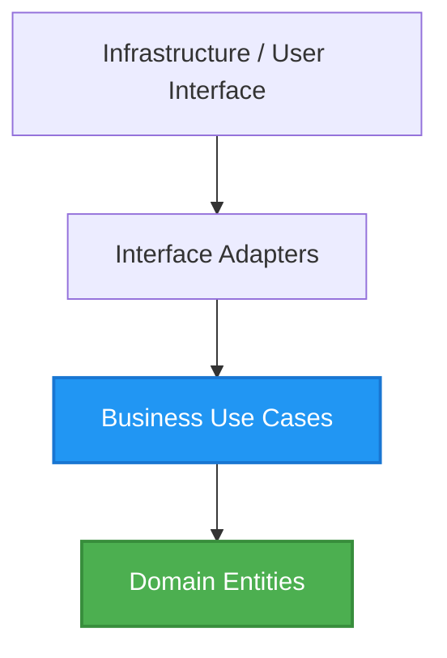

# 🏗️ System Design & Enterprise Architecture Rules for Jules

## 1. Context & Scope
- **Primary Goal:** Ensure the implementation of **software architecture** and **system design** standards to construct **scalable architecture** and write **production-ready** code.
- **Target Tooling:** Jules AI agent (Vibe Coding).
- **Tech Stack Version:** Technology independent (Agnostic).

  

---

## 2. Architecture Generation Instructions

When the User requests a new service or module, Jules must first rely on these **enterprise patterns**. 

> [!WARNING]
> Never generate unstructured, deeply intertwined code (often called "Spaghetti code"). Always begin by defining the clear layers and dependencies in accordance with **clean code** patterns.

### Pattern: Clean Architecture (Hexagonal / Ports & Adapters)

Diagram representing the correct dependency direction:

### Architecture Comparison for Selection

| Architecture Type | Best Suited For | Main Rule for Jules |
| :--- | :--- | :--- |
| **Monolith (MVC)** | Startups, Minimum Viable Products (MVP) | Separate data management from visual display (Model vs View). |
| **Microservices** | Large enterprise systems | Services must only communicate through Application Programming Interfaces (API) or Event systems. |
| **Clean Architecture** | Complex business rules and logic | Dependencies must only point inward toward the core Domain. |
| **CQRS** | Systems with very high read traffic | Separate the methods that write data (Command) from the methods that read data (Query). |

---

## 3. Checklist for Jules Agent

When starting a new feature:
- [ ] Identify the correct architectural layer for the new file.
- [ ] Write code that is easy to test by injecting dependencies instead of creating them internally (Dependency Injection).
- [ ] Isolate third-party libraries using interface wrappers (Adapter Pattern).
- [ ] Apply clear file naming conventions (for example: `user.entity.ts`, `user.controller.ts`).
