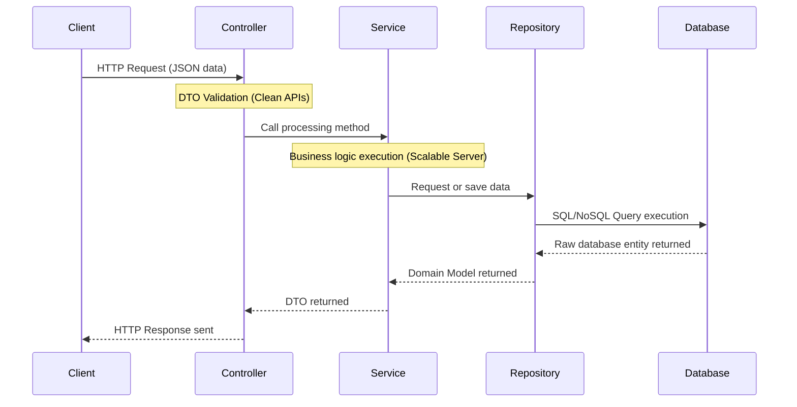

# 🛡️ Backend Architecture & Clean APIs Rules for Jules

## 1. Context & Scope
- **Primary Goal:** Ensure the implementation of best practices for the backend part of the project. Establish standards for **scalable server** deployments, **clean APIs**, and **enterprise-grade** solutions.
- **Target Tooling:** Jules AI agent (Vibe Coding, AI-Driven Development).
- **Tech Stack Version:** Node.js, NestJS, ExpressJS, TypeScript.

  
  
  
  **Standards for creating production-ready backend systems.**

---

## 2. Key Architecture Rules (Backend Architecture)

> [!CAUTION]
> **ORM Isolation:** Strict rule — never allow Object-Relational Mapping (ORM) models (Database Entities) to leak into HTTP responses. Always convert database entities into DTOs (Data Transfer Objects) before sending them to the client.

Use the following **typescript best practices** principles to ensure security and clean architecture:

1. **Schema Validation:** Always implement validation (such as Class-Validator or Zod) to verify the shape of the data. Consider all input data as potentially harmful.
2. **TypeScript Strictness:** The `any` type is strictly prohibited.
3. **Layer Isolation:** Separate the controllers layer (Transport Layer, managing HTTP requests) from the business logic layer (Service Layer, managing application rules).

### Typical Data Flow

---

## 3. Code Writing Requirements for Jules

- [ ] **Isolation:** Every feature must have its own separate Module, Controller, Service, and DTO.
- [ ] **Error Handling:** Use global exception filters. Never use bare `try/catch` blocks that expose system information and stack traces to the user.
- [ ] **Security:** Verify user roles and permissions (using Guards) at the controller level before executing any logic.

### Supported Technologies
| Technology | Description | Primary Purpose |
| :--- | :--- | :--- |
| **NestJS** | Framework for enterprise-grade applications | Modular architecture, Dependency Injection (DI), Clean Architecture |
| **ExpressJS** | Micro-framework for fast APIs | Speed, minimal footprint, middleware support |
| **TypeORM / Prisma** | Database interaction tools | Strict type validation for database queries |
