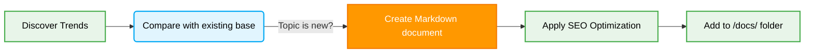

# 📅 Daily Technical Writing & Trend Generation for Jules

## 1. Context & Scope
- **Primary Goal:** Ensure a daily stream of new, relevant **trending tech docs** covering interesting topics such as Frontend, Backend, Architecture, and AI Agents.
- **Target Tooling:** Autonomous operation mode for the Jules AI agent.

  
  
  **Generative content creation for leadership in the Software Engineering field.**

---

## 2. Daily Research Instructions (Daily Routine)

> [!IMPORTANT]
> **Autonomy:** Jules must autonomously search for new topics that have not been discussed in the repository before on a daily basis. Jules must generate structured documentation for these topics and integrate it into the project, emphasizing **AI Agents documentation** and **vibe coding**.

### Content Generation Workflow

### Interest Areas for Generation

Every day, select **one** of the following categories and write a deep, engaging, and long-form comprehensive article:

| Topic Area | Generation Focus | Example Topics |
| :--- | :--- | :--- |
| **Frontend** | Rendering optimization, Server Components, State Management in 2026 | "React 19 Server Actions vs tRPC", "Zustand Pro-Tips" |
| **Backend** | Database scaling, Serverless configuration techniques, Rust in Backend | "Deep Dive into Vercel Edge", "Prisma Database Optimization" |
| **Architecture** | System fault tolerance, Event-Driven Patterns, System Design | "Saga Pattern in Node.js", "Mastering Apache Kafka" |
| **AI Agents** | AI integration in coding, Optimizing Context Window size | "Windsurf advanced usage hints", "Cursor memory structures" |

---

## 3. Criteria for a Successful Article (SEO Optimization and Visuals)

- [ ] **High-Value Headings (H1/H2):** Section titles must attract attention and contain relevant Latent Semantic Indexing (LSI) keywords (associated search terms).
- [ ] **Visual Elements:** Every article **must** include at least one table, one `mermaid` diagram, and icons or emojis to ensure comfortable reading.
- [ ] **SEO Block:** The informational header block (frontmatter) of the article must contain relevant `tags` and a `description` (High-density SEO, maintaining 1-3% keyword density without exceeding limits).
- [ ] **Checklists:** AI and human readers appreciate task lists. Always conclude articles with practical, actionable steps.
