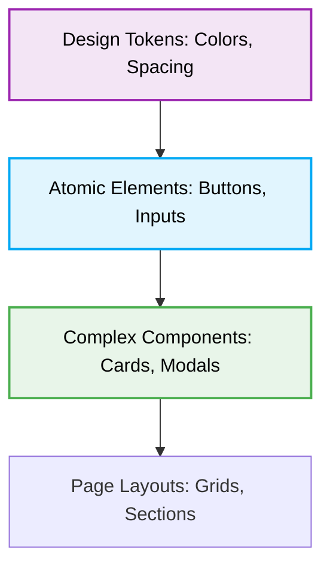

# 🎨 UI/UX Design & Styling Rules for Jules

## 1. Context & Scope
- **Primary Goal:** Maintain a consistent, **accessible (a11y)**, and visually appealing user interface across all applications through strict **responsive design** practices.
- **Target Tooling:** Jules AI agent (UI Generation & CSS Audits).
- **Tech Stack Version:** Agnostic (CSS, SCSS, Tailwind, Material UI, etc.).

  

---

## 2. Design System & Styling Rules

> [!CAUTION]
> **Hardcoded Values:** Never use hardcoded colors, spacing, or typography values (`#FF0000`, `14px`). Always use established **Design Tokens** (e.g., CSS Variables or Tailwind classes like `text-primary`, `p-4`).

### Responsive & Adaptive Principles
1. **Mobile-First Approach:** Always write base CSS for mobile screens first, then progressively enhance the design for larger screens using `min-width` media queries.
2. **Fluid Layouts:** Prefer relative units (`rem`, `em`, `vh`, `vw`, `%`) over absolute units (`px`) for layout structures and typography to allow proper scaling.

### Accessibility (A11y) Standards
1. **Semantic HTML:** Use native, meaningful HTML5 tags (`<button>`, `<nav>`, `<main>`, `<article>`) instead of generic `
` wrappers with click handlers.
2. **Keyboard Navigation:** Ensure every interactive element is reachable via the `Tab` key and visually indicates focus (`:focus-visible`).
3. **Contrast & ARIA:** Maintain a WCAG AA-compliant contrast ratio (minimum 4.5:1 for normal text). Use WAI-ARIA attributes (`aria-label`, `aria-hidden`) only when semantic HTML is insufficient.

### UI Component Architecture

---

## 3. Checklist for Jules Agent

When generating UI components or modifying styles:
- [ ] Verify that the component works properly on mobile (`320px`), tablet, and desktop viewports.
- [ ] Check if the element handles long text variations without breaking the layout (overflow control).
- [ ] Ensure all images have descriptive `alt` attributes, or empty `alt=""` if strictly decorative.
- [ ] Validate that interactive state changes (hover, active, disabled) are clearly visible to the user.
