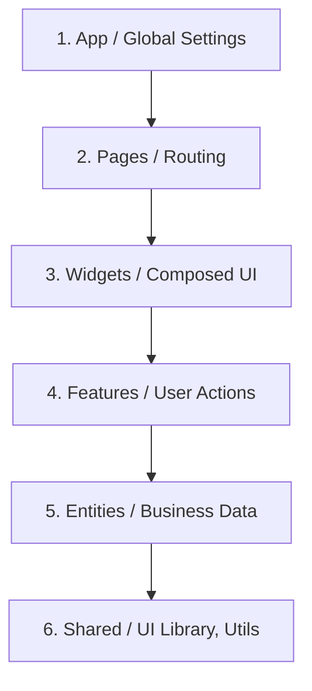

# 🎨 Frontend Architecture & FSD Rules for Jules

## 1. Context & Scope
- **Primary Goal:** Implement **clean code** and **frontend architecture** to create highly scalable and robust user interfaces.
- **Target Tooling:** Jules AI agent (Vibe Coding).
- **Tech Stack Version:** React, Angular, TypeScript.

  
  
  
  
  **Creating enterprise-grade, production-ready frontend solutions.**

---

## 2. Feature-Sliced Design (FSD)

> [!IMPORTANT]
> **Isolation:** Components in a specific layer can only import components from layers located below them. Never violate the flow of unidirectional dependencies (one-way data flow) in FSD.

### Architecture Layers

| Layer | Description | Examples |
| :--- | :--- | :--- |
| **App** | Application initialization, global styles, routing configuration. | `StoreProvider`, `Global Router` |
| **Pages** | Composition of widgets to construct full pages. | `HomePage`, `ProfilePage` |
| **Widgets** | Complex, independent sections of the user interface. | `Header`, `UserProfile` |
| **Features** | Actions that deliver direct business value to the user. | `AuthByEmail`, `AddToCart` |
| **Entities** | Business objects and their associated state. | `User`, `Product` |
| **Shared** | Reusable code, generic UI (User Interface) components, and utility functions. | `Button`, `apiKit`, `utils` |

---

## 3. UI and Logic Requirements for Jules

When creating or refactoring **frontend architecture**:
- [ ] **TypeScript Strictness:** Do not use the `any` type. Explicitly define an `interface` object structure for component Properties (Props) and internal State.
- [ ] **Logic Separation:** Keep UI components focused on visual presentation only (Presentational). Move business logic into custom Hooks or Services.
- [ ] **Styling:** Encapsulate styles locally (using CSS Modules or Tailwind utility classes) to prevent styles from unintentionally affecting other elements (CSS leakage).
- [ ] **Vibe Coding:** Maintain code consistency. If the project uses Angular, apply standard Angular patterns (Services, RxJS for reactive programming). If React is used, write functional components and Hooks.
