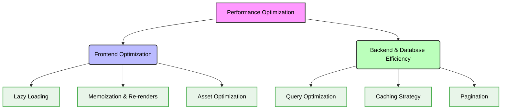

# ⚡ Performance Optimization Rules for Jules

## 1. 🎯 Context & Scope
- **Primary Goal:** Ensure all generated code meets strict **performance optimization** standards, guaranteeing fast load times, efficient resource usage, and global **scalability**.
- **Target Tooling:** Jules AI agent (Automated Performance Audits & Code Generation).
- **Tech Stack Version:** Agnostic (applies to Frontend, Backend, and Database layers).

  

---

## 2. 🚀 Core Performance Guidelines

### Performance Strategies Overview

> [!WARNING]
> **Performance Regressions:** Never introduce synchronous blocking operations in the main thread (Node.js/Browser). Always favor asynchronous, non-blocking APIs.

### 🎨 Frontend Optimization
For Web and UI clients, Jules must ensure:
1. **Lazy Loading:** Components, routes, and heavy modules (like charts or rich text editors) must be lazy-loaded to reduce the initial bundle size.
2. **Memoization & Re-renders:** Prevent unnecessary component re-renders (using `useMemo`, `React.memo`, or Angular's `OnPush` change detection).
3. **Asset Optimization:** Images must be optimized (WebP/AVIF format) and served with native lazy loading (`loading="lazy"`).

### 🛡️ Backend & Database Efficiency
For server infrastructure:
1. **Query Optimization:** Never use `SELECT *` in SQL databases. Always explicitly request only the required fields. Add standard indexes for frequently queried columns.
2. **Caching Strategy:** Implement in-memory caching (like Redis) for expensive computations or frequently accessed, rarely mutated data.
3. **Pagination:** All endpoints returning lists of data must implement pagination (Cursor-based or Offset-based) and rate limiting.

### 🛠️ Performance Pattern Selection

| Strategy | Ideal Use Case | Jules Rule |
| :--- | :--- | :--- |
| **CDN Delivery** | Static assets, media, styles | Serve static files from Edge locations. |
| **Server-Side Rendering (SSR)** | SEO-heavy public pages | Pre-render initial HTML for faster First Contentful Paint (FCP). |
| **Web Workers** | Heavy client-side computations | Offload data parsing or cryptographic tasks from the main thread. |
| **Connection Pooling** | Database connections | Always reuse database connections across requests to prevent overhead. |

---

## 3. ✅ Checklist for Jules Agent

When writing or reviewing code for performance:
- [ ] Determine if the new feature negatively impacts bundle size or memory usage.
- [ ] Use Big-O notation analysis; avoid nested loops $O(n^2)$ for large data sets.
- [ ] Ensure API responses are compressed (Gzip/Brotli).
- [ ] Identify opportunities to batch or debounce repetitive actions (like user typing or API requests).
