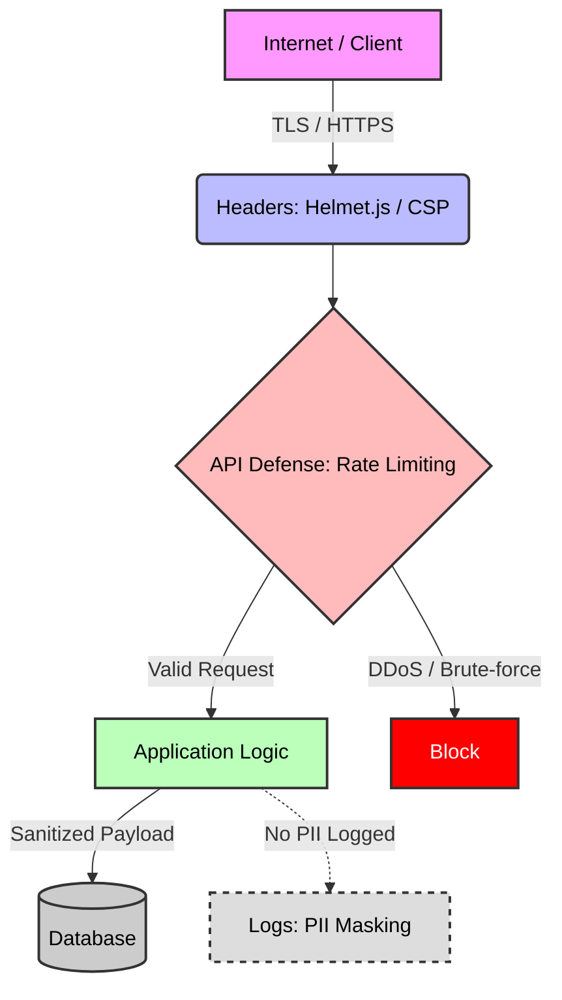

# 🛡️ System Security & Hardening Rules for Jules

## 🎯 1. Context & Scope
- **Primary Goal:** Protect application data and user privacy by strictly enforcing **secure coding** practices and preventing common **OWASP Top 10** vulnerabilities.
- **Target Tooling:** Jules AI agent (Security Audits, Authentication Logic Generation).
- **Tech Stack Version:** Agnostic (Cybersecurity Best Practices).

  

---

## 🌐 2. Global Threat Mitigation Protocols

> [!WARNING]
> **Secret Leakage:** Never hardcode secrets, API keys, passwords, or tokens in the codebase. Always load sensitive data via environment variables (`process.env`) and inject them securely.

### 🛑 OWASP Top 10 Prevention
1. **Injection (SQLi, NoSQLi, Command):** Never directly concatenate user input into database queries or shell commands. Always use parameterized queries (Prepared Statements) or an approved ORM/Query Builder.
2. **Cross-Site Scripting (XSS):** Automatically escape or sanitize all untrusted user content before rendering it in the browser. Do not use dangerously permissive innerHTML setters without a strict HTML sanitizer (like DOMPurify).
3. **Cross-Site Request Forgery (CSRF):** State-changing endpoints must require modern CSRF mitigation, such as SameSite cookies or Anti-CSRF tokens.

### 🔐 Identity & Access Management (IAM)
1. **Authentication:** Passwords must be hashed using strong, salted algorithms (e.g., Argon2, bcrypt). Plaintext passwords must never hit the database or logs.
2. **Authorization:** Implement Principle of Least Privilege (PoLP). Role-Based Access Control (RBAC) or Attribute-Based Access Control (ABAC) must be checked at the *server level*, not just hidden on the client UI.

### 🏛️ Security Architecture

| Security Layer | Pattern/Standard | Jules Requirement |
| :--- | :--- | :--- |
| **Transport** | TLS / HTTPS | Ensure all intra-service and external communication is encrypted (HTTPS only). |
| **API Defense** | Rate Limiting | Add middleware to block brute-force and DDoS attempts per IP/User. |
| **Headers** | Helmet.js / CSP | Set strict Content Security Policy (CSP), HSTS, and X-Content-Type-Options. |
| **Data Privacy** | PII Masking | Never log Personally Identifiable Information (PII) like passwords or credit cards. |

---

## ✅ 3. Checklist for Jules Agent

When generating new backend endpoints, architectures, or frontend forms:
- [ ] Validate and sanitize all incoming payload data against a strict schema (e.g., Zod, Class-Validator).
- [ ] Ensure authentication tokens (JWT, Session IDs) are stored securely (HttpOnly, Secure, SameSite cookies).
- [ ] Confirm no sensitive system stack traces or error details are returned to the client in HTTP responses.
- [ ] Verify that updating or fetching a resource confirms the requesting user actually owns that resource (Insecure Direct Object Reference prevention).
