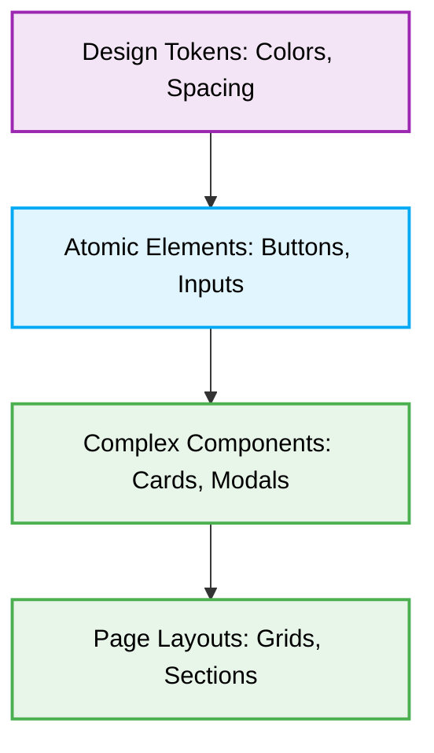

# 🎨 UI/UX Design Production-Ready Best Practices

This document outlines the production-ready best practices for UI/UX Design and styling, specifically tailored for the Jules AI agent. It ensures consistent, accessible, and responsive user interfaces.

## 📖 1. Context & Scope
- **Primary Goal:** Maintain a consistent, **accessible (a11y)**, and visually appealing user interface across all applications through strict **responsive design** practices.
- **Target Tooling:** Jules AI agent (UI Generation & CSS Audits).
- **Tech Stack Version:** Agnostic (CSS, SCSS, Tailwind, Material UI, etc.).

<div align="center">
  
</div>

---
## 🎨 2. Design System & Styling Rules

> [!CAUTION]
> **Hardcoded Values:** Never use hardcoded colors, spacing, or typography values (`#FF0000`, `14px`). Always use established **Design Tokens** (e.g., CSS Variables or Tailwind classes like `text-primary`, `p-4`).

### ❌ Bad Practice
```css
.button {
  background-color: #FF0000;
  padding: 14px 20px;
  font-size: 16px;
  border-radius: 4px;
}
```

### ⚠️ Problem
Hardcoded values create inconsistencies, complicate theming (like dark mode), and make broad design updates a nightmare. They lack semantic meaning, leading to bloated stylesheets and a fragile codebase.

### ✅ Best Practice
```css
.button {
  background-color: var(--color-primary);
  padding: var(--spacing-md) var(--spacing-lg);
  font-size: var(--font-size-base);
  border-radius: var(--radius-sm);
}
```

### 🚀 Solution
Design Tokens centralize stylistic values. By referencing variables (e.g., CSS Custom Properties or Utility Classes), you ensure systemic consistency, simplify maintenance, and enable rapid theming and scalability across applications.

---
## 📱 3. Responsive & Adaptive Principles

### ❌ Bad Practice
```css
.container {
  width: 960px;
}

@media (max-width: 768px) {
  .container {
    width: 100%;
  }
}
```

### ⚠️ Problem
A desktop-first approach with absolute units (`px`) often leads to horizontal scrolling on mobile devices and rigid layouts that break unpredictably on intermediate screen sizes.

### ✅ Best Practice
```css
.container {
  width: 100%;
  padding: 1rem;
}

@media (min-width: 768px) {
  .container {
    max-width: 48rem;
    padding: 2rem;
  }
}
```

### 🚀 Solution
Implement a **Mobile-First Approach** using relative units (`rem`, `%`). Establish base styles for mobile, then progressively enhance for larger viewports via `min-width` media queries. This ensures fluid, universally adaptable layouts.

---
## ♿ 4. Accessibility (A11y) Standards

### ❌ Bad Practice
```html
<div class="submit-button" onclick="submitForm()">Submit</div>
```

### ⚠️ Problem
Generic wrappers like `<div>` lack semantic meaning. Screen readers will not announce them as interactive, and they cannot be naturally focused via keyboard navigation (`Tab`), excluding users relying on assistive technologies.

### ✅ Best Practice
```html
<button class="submit-button" type="submit" aria-label="Submit Form">Submit</button>
```

### 🚀 Solution
Enforce Semantic HTML. Native elements provide built-in accessibility. Ensure interactive components possess visual focus states (`:focus-visible`), maintain WCAG AA contrast (4.5:1), and appropriately utilize ARIA attributes only when native semantics are insufficient.

---
## 🏗️ 5. UI Component Architecture



---
## ✅ 6. Checklist for Jules Agent

When generating UI components or modifying styles:
- [ ] Verify that the component works properly on mobile (`320px`), tablet, and desktop viewports.
- [ ] Check if the element handles long text variations without breaking the layout (overflow control).
- [ ] Ensure all images have descriptive `alt` attributes, or empty `alt=""` if strictly decorative.
- [ ] Validate that interactive state changes (hover, active, disabled) are clearly visible to the user.
