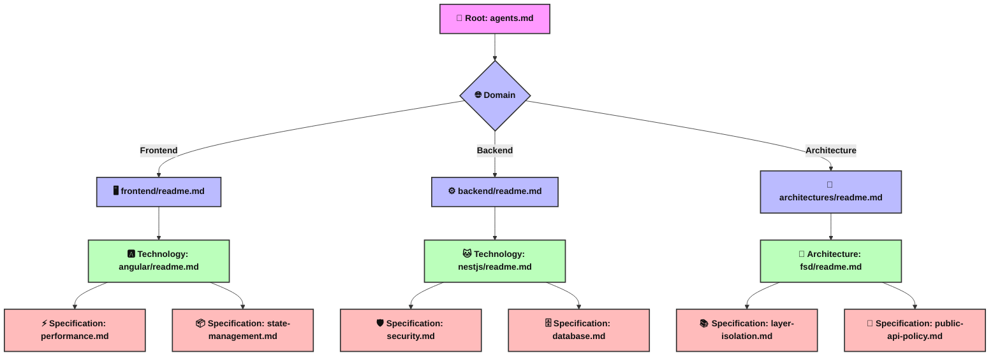

<div align="center">
  
  
  # Best-Practise: AI Agent Context

  [](#)
  [](#)
  [](#)
  [](#)

  **"The Gold Standard for AI Agent Context Injection."**
</div>

# Context & Scope
- **Primary Goal:** Provide an AI-readable index for all architectural and technological constraints to ensure Vibe Coding best practices.
- **Target Tooling:** Cursor, Windsurf, Antigravity, GitHub Copilot.
- **Tech Stack Version:** Agnostic
---

## 🚀 The "Vibe Coding" Value Proposition

**The Problem:** Generic LLMs produce generic code because they lack deep project context. Without strict architectural guidelines, codebases built with AI quickly turn into unmaintainable spaghetti code.

**The Solution:** This repository provides a global, open-source library of meta-instructions for **Vibe Coding**. By injecting these strict architectural constraints into your AI agents, you ensure **deterministic, scalable, and "beautiful" production-ready code generation**.

---

## 🗺️ Interactive Tech Stack Map

| Domain | Technology | Status |
|:---|:---|:---:|
| **Frontend** |  [Angular 20+](frontend/angular/) <br>  [JavaScript (ES6+)](frontend/javascript/) <br>  [TypeScript](frontend/typescript/) | ✅ |
| **Backend** |  [NestJS](backend/nestjs/) <br>  [Express.js](backend/express/) <br>  [Node.js](backend/nodejs/) | ✅ |
| **Architecture** | 📐 [Feature-Sliced Design (FSD)](architecture/fsd/) <br> 🏗️ [MVC](architecture/mvc/) | 🛠️ |

---

## 🤖 Топ-10 AI Агентов и Инструментов (IDE)

В современных реалиях Vibe Coding активно используются следующие мощные AI инструменты. Вот 10 самых популярных из них:

| Логотип | Инструмент | Описание |
|:---:|:---|:---|
|  | **Cursor AI** | Продвинутый форк VS Code, глубоко интегрированный с моделями (Claude 3.5 Sonnet, GPT-4o) для автодополнения и рефакторинга целых кодовых баз. |
|  | **Antigravity IDE** | Мощная автономная среда и AI-агент от команды Google DeepMind. Понимает сложный контекст и многоэтапные задачи. |
|  | **GitHub Copilot** | Главный ИИ-помощник от GitHub и OpenAI, который был пионером в автодополнении кода и продолжает развиваться (Copilot Workspace). |
|  | **Windsurf** | Революционная IDE от Codeium с "потоковым" взаимодействием агентов и программиста (Flow State). |
|  | **Cline (бывш. Devin/Claude Dev)** | Автономный ИИ-разработчик прямо в вашем VS Code, способный создавать проекты с нуля и запускать команды в терминале. |
|  | **Aider** | Консольный AI-агент, который идеально работает с Git-репозиториями и позволяет управлять проектами прямо из терминала. |
|  | **Codeium** | Полностью бесплатный (для частного использования) и молниеносный AI-помощник, встраиваемый в любую среду разработки. |
|  | **Tabnine** | Enterprise-решение с высокой степенью конфиденциальности, обучающееся на вашем собственном коде без утечек в публичные модели. |
|  | **Amazon Q Developer** | Ассистент от AWS (ранее CodeWhisperer), отлично подходящий для интеграции с облачной инфраструктурой и поиска уязвимостей. |
|  | **Sourcegraph Cody** | Инструмент, имеющий глубокий доступ к графу вашего кода на всём предприятии для сверхточного поиска и генерации. |

---

## 🎯 Agent Integration Guide

To maximize the potential of your AI coding assistants, integrate this repository into your workflow using the following methods:

### CURSOR AI
Create or update your `.cursorrules` file at the root of your project and reference the specific instructions:
```markdown
# Base Architectural Rules
Read and strictly follow instructions from:
https://github.com/[your-repo]/best-practise/blob/main/frontend/angular/readme.md
```

### ANTIGRAVITY IDE
Antigravity supports modular instruction sets. Place the relevant rules in your `.agents/rules/` directory and update your `agents.md`:
```markdown
- [angular-best-practices.md]: Guidelines for Angular 20+ development.
- [fsd-architecture.md]: Feature-Sliced Design constraints.
```

### WINDSURF & COPILOT
When prompting Windsurf or GitHub Copilot Workspace, explicitly set the context at the beginning of your session:
> "Before writing code, reference the architectural guidelines for NestJS found in the `best-practise` repository at `backend/nestjs/readme.md`. Strictly adhere to these constraints."

---

## 🛠️ Visual Architecture: Context Deep-Dive

The repository is structured hierarchically to allow AI agents to progressively deepen their understanding of your project constraints.


## 🌴 Folder Tree

* 📦 **[best-practise](./)**
  * 📄 [agents.md](./agents.md)
  * 🌐 **[architectures/](./architectures/)**
    * 📄 [readme.md](./architectures/readme.md)
    * 🧩 **[fsd/](./architectures/fsd/)**
      * 📚 [layer-isolation.md](./architectures/fsd/layer-isolation.md)
      * 🚪 [public-api-policy.md](./architectures/fsd/public-api-policy.md)
      * 📄 [readme.md](./architectures/fsd/readme.md)
    * 🏗️ **[mvc/](./architectures/mvc/)**
      * 📄 [readme.md](./architectures/mvc/readme.md)
  * ⚙️ **[backend/](./backend/)**
    * 📄 [readme.md](./backend/readme.md)
    * 🚂 **[express/](./backend/express/)**
      * 📄 [readme.md](./backend/express/readme.md)
    * 🐱 **[nestjs/](./backend/nestjs/)**
      * 🗄️ [database.md](./backend/nestjs/database.md)
      * 📄 [readme.md](./backend/nestjs/readme.md)
      * 🛡️ [security.md](./backend/nestjs/security.md)
    * 🟢 **[nodejs/](./backend/nodejs/)**
      * 📄 [readme.md](./backend/nodejs/readme.md)
  * 🖥️ **[frontend/](./frontend/)**
    * 📄 [readme.md](./frontend/readme.md)
    * 🅰️ **[angular/](./frontend/angular/)**
      * ⚡ [performance.md](./frontend/angular/performance.md)
      * 📄 [readme.md](./frontend/angular/readme.md)
      * 📦 [state-management.md](./frontend/angular/state-management.md)
    * 🟨 **[javascript/](./frontend/javascript/)**
      * 📄 [readme.md](./frontend/javascript/readme.md)
    * 🟦 **[typescript/](./frontend/typescript/)**
      * 📄 [readme.md](./frontend/typescript/readme.md)

---

## 🤝 How to Contribute

This is a living repository. Even if you're building alone, the AI ecosystem thrives on shared knowledge. If you are an expert in a specific technology, we invite you to add your specific constraints and rules!
1. Fork the repository.
2. Navigate to the appropriate `[domain]/[technology]/` folder (or create it).
3. Add a `readme.md` with core principles, and break down complex rules into specific markdown files.
4. Submit a Pull Request.

---

<div align="center">
  <b>Author:</b> Jamoliddin Qodirov <i>(Software Architect & Teacher)</i>
</div>
