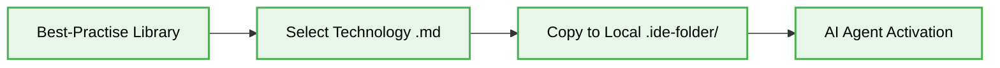
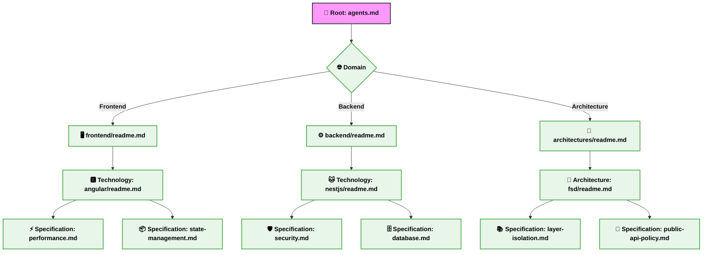

[ 🇺🇸 English ](#english) | [ 🇷🇺 Русский ](#russian)

  
  
  # Best-Practise: AI Agent Context

  
  
  
  

  **"The Gold Standard for AI Agent Context Injection."**

# ⚙️ Context & Scope
- **Primary Goal:** Provide an AI-readable index for all architectural and technological constraints to ensure Vibe Coding best practices.
- **Target Tooling:** Cursor, Windsurf, Antigravity, GitHub Copilot.
- **Tech Stack Version:** Agnostic

---

## 🚀 The "Vibe Coding" Value Proposition

**The Problem:** Generic LLMs produce generic code because they lack deep project context. Without strict architectural guidelines, codebases built with AI quickly turn into unmaintainable spaghetti code.

**The Solution:** This repository provides a global, open-source library of meta-instructions for **Vibe Coding**. By injecting these strict architectural constraints into your AI agents, you ensure **deterministic, scalable, and "beautiful" production-ready code generation**.

---

## 🗺️ Interactive Tech Stack Map

| Domain | Technology | Status |
|:---|:---|:---:|
| **Frontend** |  [Angular 20+](frontend/angular/)    [JavaScript (ES6+)](frontend/javascript/)    [TypeScript](frontend/typescript/) | ✅ |
| **Backend** |  [NestJS](backend/nestjs/)    [Express.js](backend/express/)    [Node.js](backend/nodejs/) | ✅ |
| **Architecture** | 📐 [Feature-Sliced Design (FSD)](architecture/fsd/)   🏗️ [MVC](architecture/mvc/) | 🛠️ |

---

## 🤖 Топ-10 AI Агентов и Инструментов (IDE)

В современных реалиях Vibe Coding активно используются следующие мощные AI инструменты. Вот 10 самых популярных из них:

| Логотип | Инструмент | Описание |
|:---:|:---|:---|
|  | **Cursor AI** | An advanced fork of VS Code, deeply integrated with models (Claude 3.5 Sonnet, GPT-4o) for autocompletion and refactoring of entire codebases. |
|  | **Antigravity IDE** | A powerful standalone environment and AI agent from the Google DeepMind team. Understands complex context and multi-step tasks. |
|  | **GitHub Copilot** | The main AI assistant from GitHub and OpenAI, which pioneered code autocompletion and continues to evolve (Copilot Workspace). |
|  | **Windsurf** | A revolutionary IDE from Codeium with "streaming" interaction between agents and programmers (Flow State). |
|  | **Cline (formerly Devin/Claude Dev)** | An autonomous AI developer right in your VS Code, capable of creating projects from scratch and running commands in the terminal. |
|  | **Aider** | A console AI agent that works perfectly with Git repositories and allows you to manage projects directly from the terminal. |
|  | **Codeium** | A completely free (for private use) and lightning-fast AI assistant that integrates into any development environment. |
|  | **Tabnine** | Enterprise-level solution with a high degree of confidentiality, trained on your own code without leaks to public models. |
|  | **Amazon Q Developer** | An assistant from AWS (formerly CodeWhisperer), ideal for integration with cloud infrastructure and vulnerability scanning. |
|  | **Sourcegraph Cody** | An instrument with deep access to your enterprise code graph for ultra-precise search and generation. |

---

## 🎯 Integration Guide: Injecting AI Context

To establish a deterministic, scalable **Agentic Workflow**, engineers must perform **Context Injection**. By injecting these **Deterministic Rules** into your AI toolchain, you ensure that agents strictly adhere to the project's baseline architecture and constraints.

### Context Injection Lifecycle

### Folder Mapping Table

For the **Deterministic Rules** to be accurately parsed and strictly followed, instructions MUST be placed in these specific hidden directories based on your AI tooling:

| AI Tool | Instruction Directory Mapping |
| :--- | :--- |
| **Antigravity IDE** | `.agents/rules/*.md` |
| **Cursor AI** | `.cursor/rules/*.md` |
| **Windsurf** | `.windsurf/rules/` |
| **GitHub Copilot** | `.github/copilot-instructions.md` (or root `.github/` for general context) |
| **Cloud Code AI / Claude Code** | Root directory or `.claude/` (depending on agent configuration) |
---
## 🛠️ Visual Architecture: Context Deep-Dive

The repository is structured hierarchically to allow AI agents to progressively deepen their understanding of your project constraints.

## 🌴 Folder Tree

* 📦 **[best-practise](./)**
  * 📄 [agents.md](./agents.md)
  * 🌐 **[architectures/](./architectures/)**
    * 📄 [readme.md](./architectures/readme.md)
    * 🧩 **[fsd/](./architectures/fsd/)**
      * 📚 [layer-isolation.md](./architectures/fsd/layer-isolation.md)
      * 🚪 [public-api-policy.md](./architectures/fsd/public-api-policy.md)
      * 📄 [readme.md](./architectures/fsd/readme.md)
    * 🏗️ **[mvc/](./architectures/mvc/)**
      * 📄 [readme.md](./architectures/mvc/readme.md)
  * ⚙️ **[backend/](./backend/)**
    * 📄 [readme.md](./backend/readme.md)
    * 🚂 **[express/](./backend/express/)**
      * 📄 [readme.md](./backend/express/readme.md)
    * 🐱 **[nestjs/](./backend/nestjs/)**
      * 🗄️ [database.md](./backend/nestjs/database.md)
      * 📄 [readme.md](./backend/nestjs/readme.md)
      * 🛡️ [security.md](./backend/nestjs/security.md)
    * 🟢 **[nodejs/](./backend/nodejs/)**
      * 📄 [readme.md](./backend/nodejs/readme.md)
  * 🖥️ **[frontend/](./frontend/)**
    * 📄 [readme.md](./frontend/readme.md)
    * 🅰️ **[angular/](./frontend/angular/)**
      * ⚡ [performance.md](./frontend/angular/performance.md)
      * 📄 [readme.md](./frontend/angular/readme.md)
      * 📦 [state-management.md](./frontend/angular/state-management.md)
    * 🟨 **[javascript/](./frontend/javascript/)**
      * 📄 [readme.md](./frontend/javascript/readme.md)
    * 🟦 **[typescript/](./frontend/typescript/)**
      * 📄 [readme.md](./frontend/typescript/readme.md)

---

## 🤝 How to Contribute

This is a living repository. Even if you're building alone, the AI ecosystem thrives on shared knowledge. If you are an expert in a specific technology, we invite you to add your specific constraints and rules!
1. Fork the repository.
2. Navigate to the appropriate `[domain]/[technology]/` folder (or create it).
3. Add a `readme.md` with core principles, and break down complex rules into specific markdown files.
4. Submit a Pull Request.

---

  <b>Author:</b> Jamoliddin Qodirov <i>(Software Architect & Teacher)</i>

---

  
  
  # Best-Practise: Контекст агента ИИ

  
  
  
  

  **"Золотой стандарт для внедрения контекста в ИИ-агентствах."**

# ⚙️ Контекст & Сфера применения
- **Основная цель:** Обеспечить AI-читаемый индекс для трансляции архитектурных концепций и технологических Constraints (Ограничения) с целью обеспечения стандартов Vibe Coding.
- **Целевое ПО (Target Tooling):** Cursor, Windsurf, Antigravity, GitHub Copilot.
- **Версия техстека:** Агностична

---

## 🚀 "Vibe Coding" Ценностное предложение

**Проблема:** Базовые LLM генерируют абстрактный код по причине дефицита глубокого контекста о проекте. Отсутствие строго регламентированных архитектурных ограничений неизбежно приводит к переходу кодовой базы, сгенерированной ИИ, в технический долг (спагетти-код) и провоцирует Hallucinations (Галлюцинации).

**Решение:** Данный репозиторий представляет собой эталонную open-source библиотеку мета-инструкций для **Vibe Coding**. Осуществляя строгий AI Context Injection в ваших агентах, вы достигаете **детерминированного транслирования архитектуры, обеспечения масштабируемости и генерации production-ready кода**.

---

## 🗺️ Интерактивная карта технологического стека

| Домен | Технология | Статус |
|:---|:---|:---:|
| **Frontend** |  [Angular 20+](frontend/angular/)    [JavaScript (ES6+)](frontend/javascript/)    [TypeScript](frontend/typescript/) | ✅ |
| **Backend** |  [NestJS](backend/nestjs/)    [Express.js](backend/express/)    [Node.js](backend/nodejs/) | ✅ |
| **Architecture** | 📐 [Feature-Sliced Design (FSD)](architecture/fsd/)   🏗️ [MVC](architecture/mvc/) | 🛠️ |

---

## 🤖 Топ-10 AI Агентов и Инструментов (IDE)

В парадигме Vibe Coding в продакшене внедрены следующие ИИ-инструменты. Ниже приведен топ-10 актуальных решений:

| Логотип | Инструмент | Описание |
|:---:|:---|:---|
|  | **Cursor AI** | Продвинутый форк VS Code с нативной интеграцией LLM (Claude 3.5 Sonnet, GPT-4o) для автокомплита и кросс-файлового рефакторинга. |
|  | **Antigravity IDE** | Высокоуровневая автономная среда с AI-агентом от Google DeepMind. Спроектирована для интерпретации сложного контекста и решения комплексных задач. |
|  | **GitHub Copilot** | Флагманский ИИ-инструмент интеграции модели от GitHub. Включает парадигму Copilot Workspace для управления репозиториями. |
|  | **Windsurf** | IDE от Codeium. Внедряет парадигму Flow State для достижения непрерывного потокового взаимодействия "инженер-агент". |
|  | **Cline (ex Devin/Claude Dev)** | Автономный ИИ-разработчик как расширение VS Code. Осуществляет выполнение консольных команд и bootstrap проектов. |
|  | **Aider** | Консольный AI-агент. Ориентирован на нативную работу в связке с Git-архитектурой для выполнения команд из терминала. |
|  | **Codeium** | Производительный ИИ-ассистент, доступный для широкого пула IDE поверх локальной инфраструктуры разработчика. |
|  | **Tabnine** | Enterprise-решение с упором на секьюрити. Обучается изолированно на инхаус коде для пресечения утечек данных. |
|  | **Amazon Q Developer** | Корпоративный ассистент от AWS. Внедрен как модуль-профайлер облачных инфраструктур и анализа уязвимостей. |
|  | **Sourcegraph Cody** | Инструмент для дата-майнинга и анализа Enterprise-кодовых графов, обеспечивающий маппинг компонентов с высокой степенью согласованности. |

---

<!-- Agent Integration Guide moved to bilingual section above -->

---

## 🎯 Руководство по интеграции: Инъекция контекста

Для выстраивания детерминированного и масштабируемого **Agentic Workflow**, разработчики должны реализовать **Инъекцию контекста** (Context Injection). Интеграция данных **Deterministic Rules** в ваш инструментарий ИИ гарантирует строгое соблюдение базовой архитектуры и заданных ограничений агентами.

### Жизненный цикл Инъекции контекста

### Таблица: Маппинг директорий

Для того чтобы **Deterministic Rules** корректно парсились и строго исполнялись ИИ-ассистентами, инструкции ДОЛЖНЫ быть размещены в следующих скрытых директориях, в зависимости от инструмента:

| AI Инструмент | Маппинг директорий |
| :--- | :--- |
| **Antigravity IDE** | `.agents/rules/*.md` |
| **Cursor AI** | `.cursor/rules/*.md` |
| **Windsurf** | `.windsurf/rules/` |
| **GitHub Copilot** | `.github/copilot-instructions.md` (или корень `.github/` для общего контекста) |
| **Cloud Code AI / Claude Code** | Корневая директория или `.claude/` (в зависимости от конфигурации агента) |
---

## 🛠️ Visual Architecture: Context Deep-Dive

Топология проекта организована иерархически. Архитектура разработана для прогрессивного спускания AI-агентов по информационным узлам (Context Drilling) до спецификаций конкретной технологии.

## 🌴 Folder Tree

* 📦 **[best-practise](./)**
  * 📄 [agents.md](./agents.md)
  * 🌐 **[architectures/](./architectures/)**
    * 📄 [readme.md](./architectures/readme.md)
    * 🧩 **[fsd/](./architectures/fsd/)**
      * 📚 [layer-isolation.md](./architectures/fsd/layer-isolation.md)
      * 🚪 [public-api-policy.md](./architectures/fsd/public-api-policy.md)
      * 📄 [readme.md](./architectures/fsd/readme.md)
    * 🏗️ **[mvc/](./architectures/mvc/)**
      * 📄 [readme.md](./architectures/mvc/readme.md)
  * ⚙️ **[backend/](./backend/)**
    * 📄 [readme.md](./backend/readme.md)
    * 🚂 **[express/](./backend/express/)**
      * 📄 [readme.md](./backend/express/readme.md)
    * 🐱 **[nestjs/](./backend/nestjs/)**
      * 🗄️ [database.md](./backend/nestjs/database.md)
      * 📄 [readme.md](./backend/nestjs/readme.md)
      * 🛡️ [security.md](./backend/nestjs/security.md)
    * 🟢 **[nodejs/](./backend/nodejs/)**
      * 📄 [readme.md](./backend/nodejs/readme.md)
  * 🖥️ **[frontend/](./frontend/)**
    * 📄 [readme.md](./frontend/readme.md)
    * 🅰️ **[angular/](./frontend/angular/)**
      * ⚡ [performance.md](./frontend/angular/performance.md)
      * 📄 [readme.md](./frontend/angular/readme.md)
      * 📦 [state-management.md](./frontend/angular/state-management.md)
    * 🟨 **[javascript/](./frontend/javascript/)**
      * 📄 [readme.md](./frontend/javascript/readme.md)
    * 🟦 **[typescript/](./frontend/typescript/)**
      * 📄 [readme.md](./frontend/typescript/readme.md)

---

## 🤝 Стать contributer проект

В условиях развития AI-экосистемы аккумулирование Enterprise-опыта является критически важным. Инженерам, обладающим подтвержденной квалификацией (Senior level) в конкретных субдоменах, предлагается расширять реестр Constraints:
1. Выполните Fork проекта.
2. Проведите локализацию в директории `[domain]/[technology]/`.
3. Реализуйте файл `readme.md`, декларирующий ключевые парадигмы в рамках стэка. Для покрытия узкоспециализированных кейсов инициируйте декомпозицию с выделением изолированных конфигураций (например, `performance.md`).
4. Настройте Pull Request в ветку `main`.

---

  <b>Author:</b> Jamoliddin Qodirov <i>(Software Architect & Teacher)</i>

