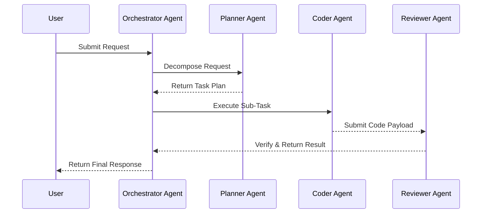

# 🌊 Agentic Architecture Data Flow

## 🗺️ Map of Patterns (Agentic Modules)
- 🏠 **[Back to Agentic Architecture Guidelines](./readme.md)**



## 1. Orchestrator-Worker Data Handoff

### ❌ Bad Practice
Passing the entire user request and previous conversational history to every agent directly without intermediate structured transformation.

### ⚠️ Problem
This causes context window overflow, pollutes the reasoning pipeline with irrelevant data, and leads to non-deterministic execution since the worker agents have to independently determine their immediate goals from raw text.

### ✅ Best Practice
> [!NOTE]
> **Internal Routing:** For more context, refer back to the [Agentic Architecture Guidelines](./readme.md).

```typescript
// Define strict schemas for handoff
interface TaskPayload {
  goal: string;
  contextParams: Record<string, any>;
  expectedOutputSchema: string;
}

function createWorkerPayload(plan: Plan, step: number): TaskPayload {
  return {
    goal: plan.steps[step].description,
    contextParams: plan.steps[step].requiredContext,
    expectedOutputSchema: plan.steps[step].schemaId
  };
}
```

### 🚀 Solution
Defining specific `TaskPayload` boundaries ensures that data flows deterministically between the orchestrator and worker agents. This enforces O(1) context scaling per worker and guarantees consistent schema validation.
