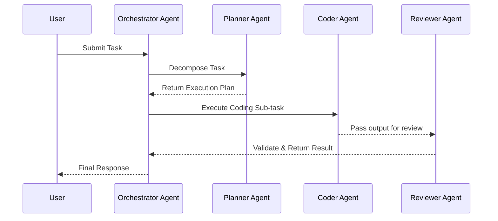

# 🔄 Agentic Architecture Data Flow Best Practices

  **Execution paths and communication between Orchestrator and Workers.**

---

## 🔁 The Sequence of Execution

In Agentic Architecture, tasks are delegated by the Orchestrator to specialized Workers, followed by validation.

## ⛔ Boundary Constraints (Data Flow Rules)

1. **Orchestrator Centralization:** All communication between agents MUST route through the Orchestrator. Agents MUST NOT communicate with each other directly to prevent context leakage.
2. **Deterministic Schemas:** Workers MUST return data in a strict, validated schema (e.g., JSON).
