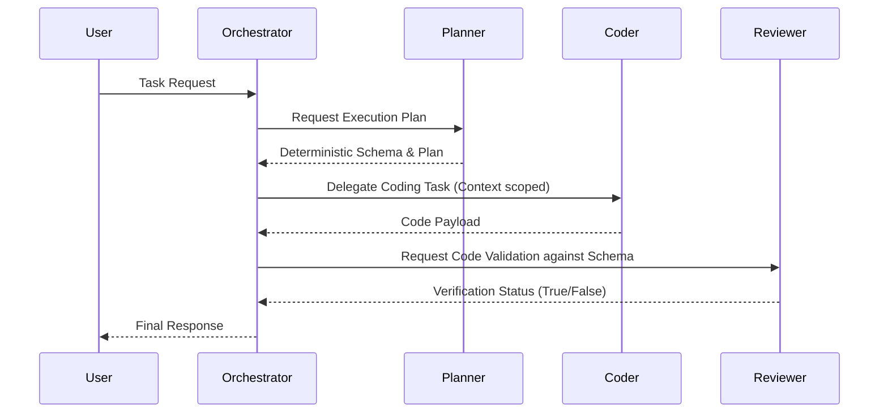

# 🌊 Agentic Architecture Data Flow

```mermaid
sequenceDiagram
    participant U as User
    participant O as Orchestrator
    participant P as Planner
    participant C as Coder
    participant R as Reviewer

    U->>O: Task Request
    O->>P: Request Execution Plan
    P-->>O: Deterministic Schema & Plan
    O->>C: Delegate Coding Task (Context scoped)
    C-->>O: Code Payload
    O->>R: Request Code Validation against Schema
    R-->>O: Verification Status (True/False)
    O-->>U: Final Response
```
