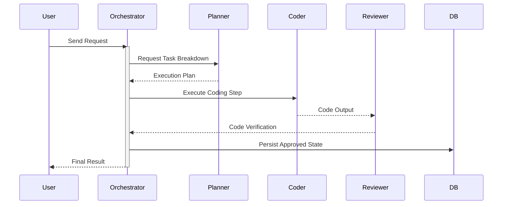

# 🌊 Agentic Architecture Data Flow

## Request Lifecycle

## Core Principles
1. **Delegation:** Orchestrator decomposes tasks and delegates.
2. **Handoff Validation:** Structured data must be validated between agent handoffs.
