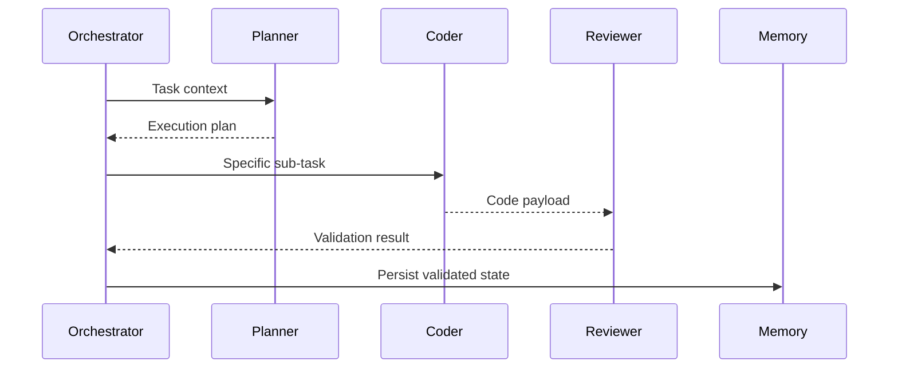

# Agentic Architecture - Data Flow
## Orchestrator-to-Worker execution paths

```mermaid
sequenceDiagram
    participant Orchestrator
    participant Planner
    participant Coder
    participant Reviewer
    participant Memory

    Orchestrator->>Planner: Task context
    Planner-->>Orchestrator: Execution plan
    Orchestrator->>Coder: Specific sub-task
    Coder-->>Reviewer: Code payload
    Reviewer-->>Orchestrator: Validation result
    Orchestrator->>Memory: Persist validated state
```
