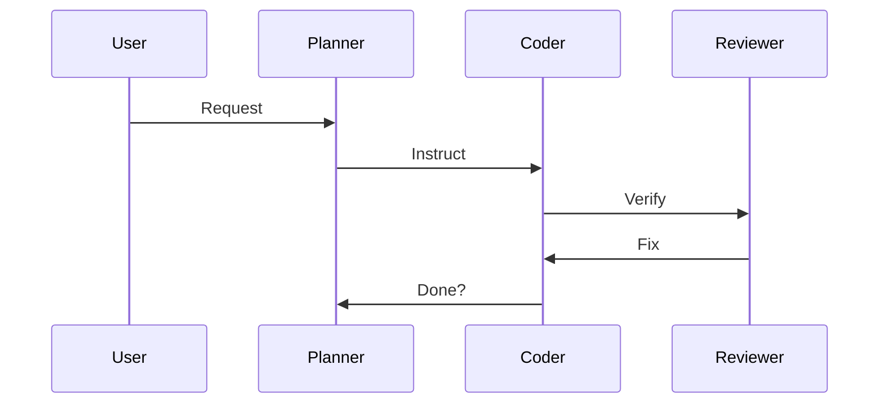
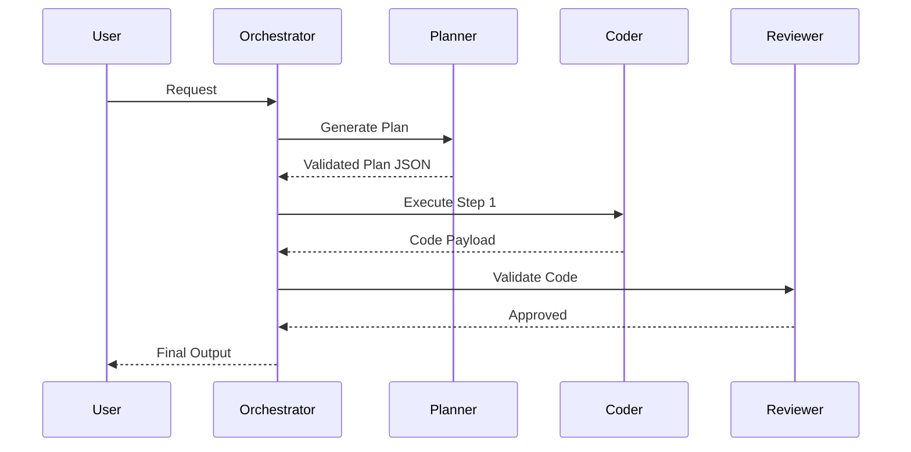

  # 🤖 Agentic Architecture - Data Flow

---

## ❌ Bad Practice
Unstructured flow without a centralized orchestrator where agents call each other directly or loop infinitely.

## ⚠️ Problem
When agents interact in an unmanaged peer-to-peer network, you risk infinite loops, context overflow, and non-deterministic results that are impossible to debug or validate systemically.

## ✅ Best Practice
Orchestrator-driven flow ensuring strict validation at every stage.

## 🚀 Solution
Centralizing data flow through an Orchestrator guarantees predictability, limits token consumption by bounding the context passed to each specialized worker, and enforces schema validation before the next agent takes over.
