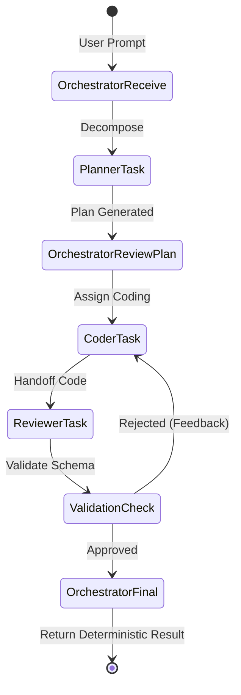

  # 🌊 Agentic Architecture Data Flow

---

## Orchestrator-to-Worker Execution Path

```mermaid
stateDiagram-v2
    [*] --> OrchestratorReceive : User Prompt
    OrchestratorReceive --> PlannerTask : Decompose
    PlannerTask --> OrchestratorReviewPlan : Plan Generated
    OrchestratorReviewPlan --> CoderTask : Assign Coding
    CoderTask --> ReviewerTask : Handoff Code
    ReviewerTask --> ValidationCheck : Validate Schema

    ValidationCheck --> CoderTask : Rejected (Feedback)
    ValidationCheck --> OrchestratorFinal : Approved
    OrchestratorFinal --> [*] : Return Deterministic Result
```
