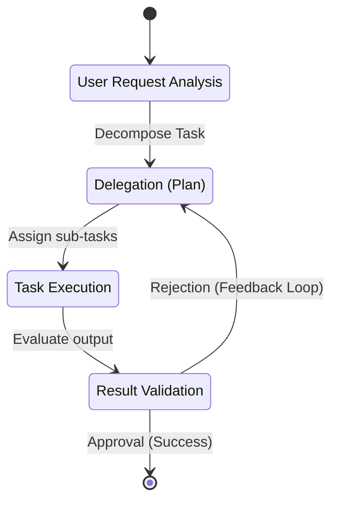

# 🌊 Agentic Architecture Data Flow

This document details the Orchestrator-to-Worker execution paths.

## Orchestration Data Flow



## 1. Context Window Isolation Flow

### ❌ Bad Practice
```typescript
class MonolithicFlow {
    async handle(request: any) {
        // Unbounded state passed globally
        const globalState = await this.db.fetchEverything();
        return this.llm.predict(`Do everything based on ${globalState} and ${request}`);
    }
}
```

### ⚠️ Problem
Passing unstructured `any` objects and unbound global state into a single prompt leads to massive token waste and high hallucination risk. The LLM loses focus, lowering determinism.

### ✅ Best Practice
```typescript
class OrchestratedFlow {
    async handle(request: string) {
        // Step 1: Narrow context strictly
        const scopedContext = await this.db.fetchRelevant(request);

        // Step 2: Pass deterministic payload
        const plan = await this.plannerAgent.execute({
            task: request,
            context: scopedContext
        });

        // Step 3: Only pass the subset needed for the next step
        const result = await this.workerAgent.execute({
            task: plan.stepOne,
            context: plan.schemaDefinition
        });

        return result;
    }
}
```

> [!IMPORTANT]
> **Context Boundary Strictness:** Never pass unfiltered global objects into an agent's context. Always parse and filter explicitly.

### 🚀 Solution
Strictly isolate state flow. Each specialized agent receives only an O(1) relevant data payload. This maximizes token efficiency, guarantees bounded reasoning paths, and strictly enforces deterministic behavior at scale.
