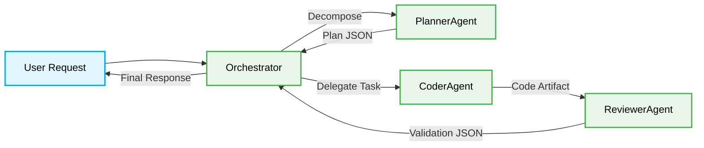

# 🌊 Data Flow: Orchestrator-to-Worker Paths

> [!NOTE]
> AI Agent workflows require strict execution paths to maintain token efficiency and deterministic output.



## The Pattern Lifecycle: Stateful Data Passes

### ❌ Bad Practice
```typescript
// Workers directly passing large untyped context strings to each other
async function workerHandOff(contextString: string) {
    return await nextAgent.process(`Here is everything: ${contextString}`);
}
```

### ⚠️ Problem
Unstructured context passing causes context window overflow, introduces hallucinations, and breaks deterministic evaluation. It leads to AI agents losing focus on their specialized tasks due to noise.

### ✅ Best Practice
```typescript
// Workers communicate exclusively through strongly-typed DTOs (Data Transfer Objects)
interface TaskPayload {
    taskId: string;
    strictSchema: unknown;
    isolatedContext: string;
}

async function secureHandOff(payload: TaskPayload) {
    const validatedData = validateSchema(payload);
    return await nextAgent.process(validatedData);
}
```

### 🚀 Solution
Implementing strongly-typed DTOs restricts data flow to exact constraints. The Orchestrator limits token exposure to worker agents, ensuring systemic stability, reduced latency, and accurate output generation.
