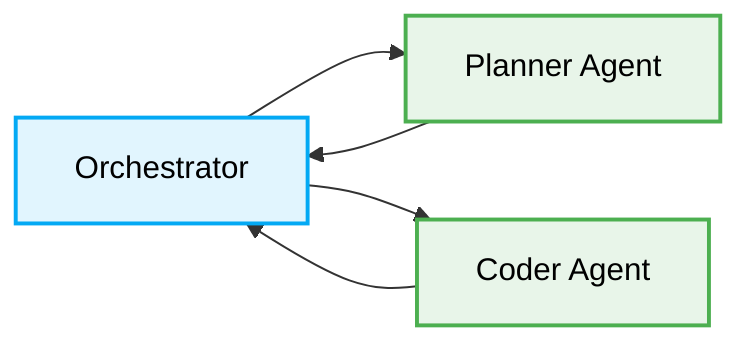

# Data Flow

```mermaid
graph LR
    Orchestrator[Orchestrator] --> Worker1[Planner Agent]
    Orchestrator --> Worker2[Coder Agent]
    Worker1 --> Orchestrator
    Worker2 --> Orchestrator

    classDef default fill:#e1f5fe,stroke:#03a9f4,stroke-width:2px,color:#000;
    classDef component fill:#e8f5e9,stroke:#4caf50,stroke-width:2px,color:#000;

    class Orchestrator default;
    class Worker1,Worker2 component;
```
