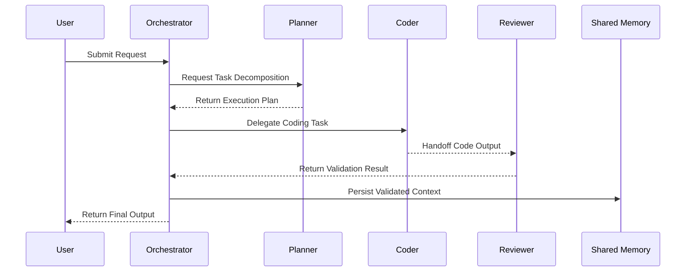

# 🌊 Agentic Architecture Data Flow

This document details the Orchestrator-to-Worker execution paths.

### ❌ Bad Practice
Failing to isolate responsibilities leads to sequential blocks where the orchestrator handles all steps synchronously, resulting in context window limits being hit rapidly.

### ⚠️ Problem
Unbounded context parsing creates slow responses and hallucinations.

### ✅ Best Practice
> [!NOTE]
> **Internal Routing:** For more context, refer back to the [Agentic Architecture Map](./readme.md).

Use event-driven handoffs between specialized workers.

### 🚀 Solution
Implementing isolated `sequenceDiagram` validated workflows keeps agents within their boundaries.
