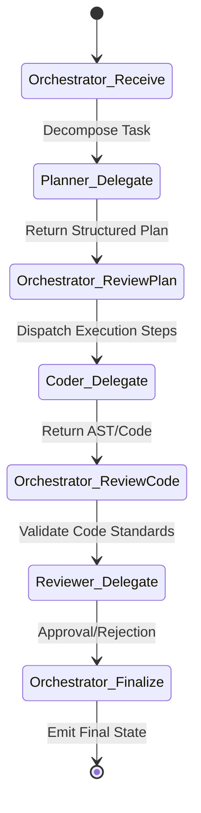

# 🌊 Agentic Architecture: Data Flow Blueprint

> [!NOTE]
> **Internal Routing:** [Agentic Architecture Map](./readme.md)

## Orchestrator-to-Worker Data Flow



## 1. Immutable State Transitions

### ❌ Bad Practice
```typescript
// Worker agent mutates global state directly during execution
class WorkerAgent {
    async execute(task: string) {
        globalContext.update(task); // HIDDEN SIDE EFFECT
        return "done";
    }
}
```

### ⚠️ Problem
When worker agents mutate global state independently, it causes race conditions and untraceable side-effects. The Orchestrator loses determinism over the process, leading to hallucinated context chains.

### ✅ Best Practice
> [!NOTE]
> **Internal Routing:** [Data Flow Rules](./data-flow.md)

```typescript
// Worker strictly returns a state delta to be validated
interface StateDelta {
    mutations: ReadonlyArray<unknown>;
}

class DeterministicWorkerAgent {
    async execute(task: string): Promise<StateDelta> {
        return { mutations: [{ type: 'ADD_FILE', payload: task }] };
    }
}
```

### 🚀 Solution
Workers MUST STRICTLY execute computations and return a deterministic `StateDelta`. Only the Orchestrator MUST apply state changes, ensuring atomic and traceable workflows.
