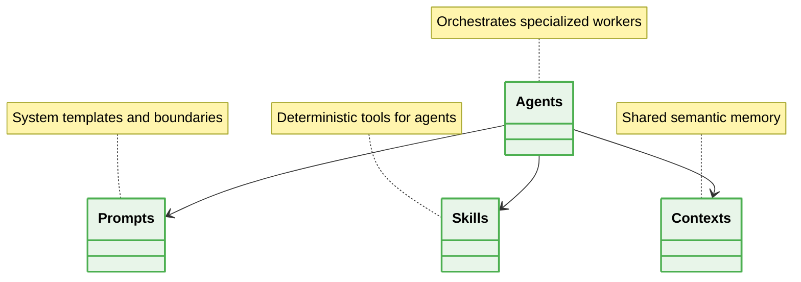

# 📁 Agentic Architecture Folder Structure

## 🗺️ Map of Patterns (Agentic Modules)
- 🏠 **[Back to Agentic Architecture Guidelines](./readme.md)**



## 1. Modularization of Agent Capabilities

### ❌ Bad Practice
```typescript
// An unstructured directory mixing prompts, logic, and tools
src/
  agents/
    monolithic-agent.ts // Contains prompt strings, tool definitions, and LLM calls
```

### ⚠️ Problem
Coupling prompt engineering, tool logic, and orchestration in single files creates unmaintainable code. Modifying a tool can accidentally break the LLM's system prompt context.

### ✅ Best Practice
> [!NOTE]
> **Internal Routing:** For more context, refer back to the [Agentic Architecture Guidelines](./readme.md).

```text
src/
  agents/
    orchestrator/
      orchestrator.agent.ts
    workers/
      coder/
        coder.agent.ts
        coder.prompt.ts
  skills/
    filesystem/
      read-file.skill.ts
    api/
      fetch-data.skill.ts
  memory/
    vector-store.ts
```

### 🚀 Solution
Strictly separating Agents, Prompts, Skills, and Memory guarantees that tools can be updated independently of the LLM logic. Prompts become versionable artifacts, and Skills become deterministic, testable units isolated from non-deterministic generation.
