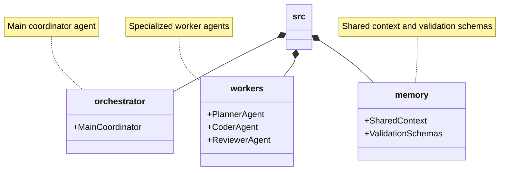

  # 📁 Agentic Architecture Folder Structure

---

## Component Relations

```mermaid
classDiagram
    class src {
    }
    class orchestrator {
        +MainCoordinator
    }
    class workers {
        +PlannerAgent
        +CoderAgent
        +ReviewerAgent
    }
    class memory {
        +SharedContext
        +ValidationSchemas
    }

    src *-- orchestrator
    src *-- workers
    src *-- memory

    note for orchestrator "Main coordinator agent"
    note for workers "Specialized worker agents"
    note for memory "Shared context and validation schemas"

    %% Design Tokens
    class orchestrator:::layout
    class workers:::component
    class memory:::default
```
