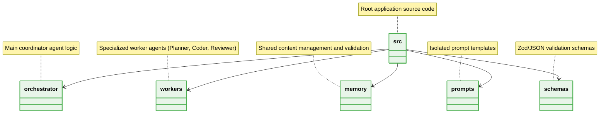

# 📁 Agentic Architecture Folder Structure

This document outlines the modular isolation of Prompts, Skills, and Contexts for Multi-Agent Systems.

## Core Hierarchy



## 1. Modular Isolation of Agent Capabilities

### ❌ Bad Practice
```text
src/
├── app.ts
├── agent.ts // Contains prompt strings, logic, and schema definitions mixed together
```

### ⚠️ Problem
Mixing logic, prompt string manipulation, and payload structures within a single file breaks separation of concerns. This causes immense difficulty when tuning prompts, updating schemas, or attempting to scale the agent to handle multiple specialized roles.

### ✅ Best Practice
```text
src/
├── orchestrator/
│   └── main-agent.ts
├── workers/
│   ├── planner.ts
│   └── coder.ts
├── prompts/
│   └── system-prompts.ts
└── schemas/
    └── task-schema.ts
```

### 🚀 Solution
Strictly enforce FSD-like layer separation. Prompts must be decoupled from execution logic, and schemas must exist as independent artifacts. This structure guarantees that an AI model can parse schemas or modify prompts without inadvertently corrupting execution routines or internal states.
