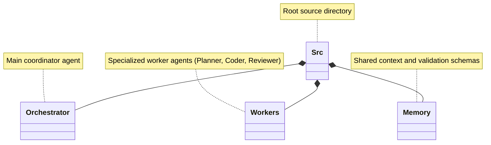

# Agentic Architecture - Folder Structure

## Layering logic

```mermaid
classDiagram
    note for Src "Root source directory"
    note for Orchestrator "Main coordinator agent"
    note for Workers "Specialized worker agents (Planner, Coder, Reviewer)"
    note for Memory "Shared context and validation schemas"

    class Src:::component
    class Orchestrator:::component
    class Workers:::component
    class Memory:::component

    Src *-- Orchestrator
    Src *-- Workers
    Src *-- Memory
```