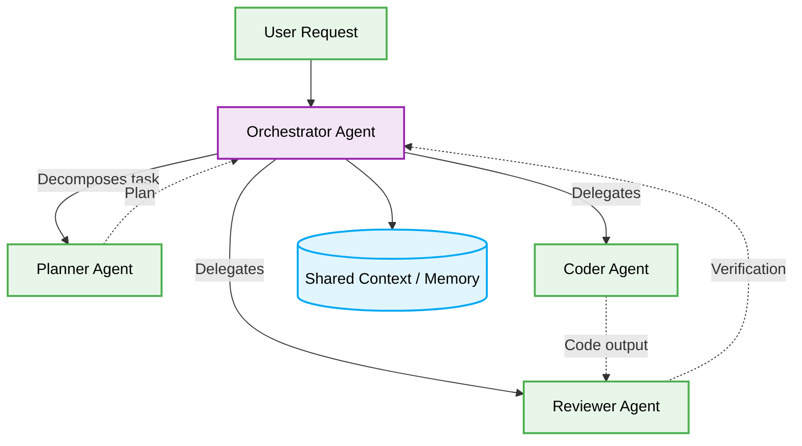

# 📁 Agentic Architecture Folder Structure



## Directory Blueprint
```text
src/
├── 📁 orchestrator/     # Main coordinator agent
├── 📁 workers/          # Specialized worker agents (Planner, Coder, Reviewer)
└── 📁 memory/           # Shared context and validation schemas
```
