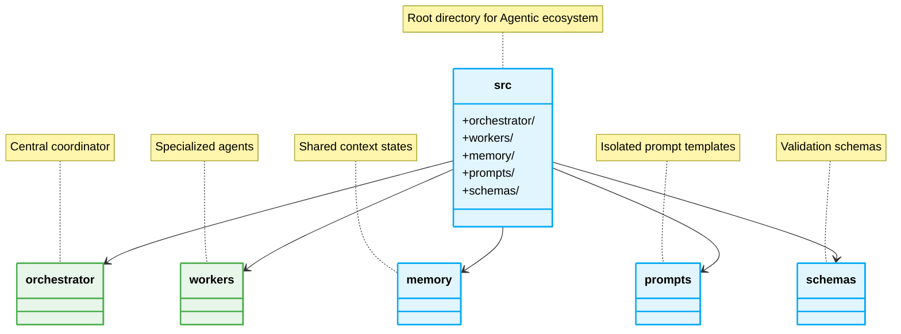

# 📁 Folder Structure: Modular Isolation

> [!IMPORTANT]
> To prevent context bleeding, strictly isolate Agent logic, prompts, and memory states.



## The Pattern Lifecycle: Global Context Bleed

### ❌ Bad Practice
```typescript
// Agent persona, logic, and context mixed in one file
export class FullAgent {
    prompt = "You are a planner and coder. Here is the schema...";
    async run() { /* monolithic logic */ }
}
```

### ⚠️ Problem
Mixing prompts, agent configuration, and logic creates rigid, untestable components. If the prompt changes, the application logic is at risk. It hinders Vibe Coding by forcing large contexts into every file.

### ✅ Best Practice
```typescript
// Specialized isolation
import { plannerPrompt } from '../prompts/planner.prompt';
import { plannerSchema } from '../schemas/planner.schema';

export class PlannerWorker {
    private promptTemplate = plannerPrompt;

    async execute(task: string) {
        // Enforces deterministic outputs via schema validation
    }
}
```

### 🚀 Solution
Isolating prompts into a `/prompts` directory and schemas into `/schemas` maintains architectural integrity. Workers only import their specific dependencies, reducing context pollution and enabling deterministic AI behavior.
