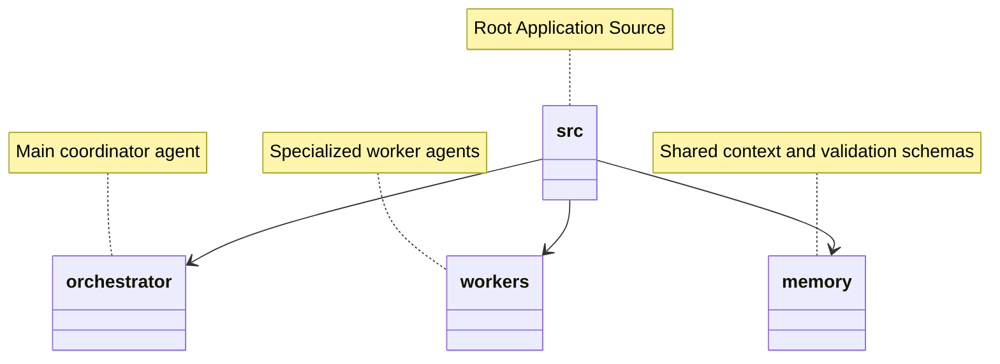

# 📁 Agentic Architecture Folder Structure

Modular isolation of Prompts, Skills, and Contexts.

### ❌ Bad Practice
Mixing orchestrator logic, worker prompts, and memory inside the same directory.

### ⚠️ Problem
Difficult to upgrade individual agent personas or swap out underlying LLM providers.

### ✅ Best Practice
> [!NOTE]
> **Internal Routing:** For more context, refer back to the [Agentic Architecture Map](./readme.md).

Strict separation of concerns by isolating schemas, memory, and specialized agent logic into distinct directories.

### 🚀 Solution
A deterministic directory structure ensures that scaling the number of agents does not pollute the orchestrator's domain.
