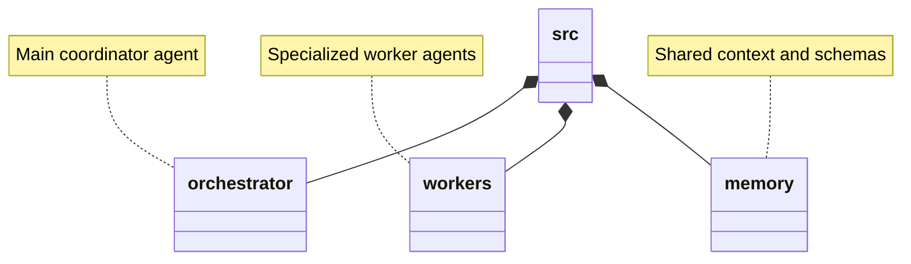

# Folder Structure

```mermaid
classDiagram
    class src
    class orchestrator
    class workers
    class memory

    src *-- orchestrator
    src *-- workers
    src *-- memory

    note for orchestrator "Main coordinator agent"
    note for workers "Specialized worker agents"
    note for memory "Shared context and schemas"

    class src:::default
    class orchestrator:::component
    class workers:::component
    class memory:::component
```
