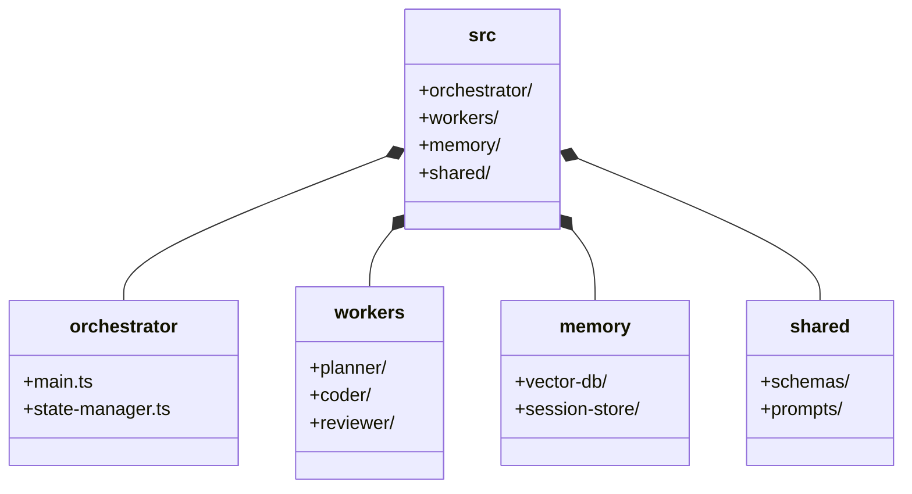

# 📁 Agentic Architecture: Folder Structure Blueprint

> [!NOTE]
> **Internal Routing:** [Agentic Architecture Map](./readme.md)

## Modular Isolation of Prompts, Skills, and Contexts



## 1. Context Boundary Enforcement

### ❌ Bad Practice
```text
src/
├── agents.ts      // Contains all prompts, schemas, and API keys
├── utils.ts
└── main.ts
```

### ⚠️ Problem
Coupling all agent logic in a single directory prevents specialized testing and encourages monolithic prompt construction, leading to context window pollution.

### ✅ Best Practice
> [!NOTE]
> **Internal Routing:** [Folder Structure Rules](./folder-structure.md)

```text
src/
├── orchestrator/          # Only coordination logic
├── workers/
│   ├── planner/           # Planner specific prompts/skills
│   └── coder/             # Coder specific tools/AST parsers
├── shared/
│   └── schemas/           # Zod/Type definitions for I/O validation
```

### 🚀 Solution
The codebase MUST STRICTLY enforce boundary limits. Domain logic for specific personas MUST be isolated within `workers/`, while deterministic I/O schemas MUST reside in `shared/schemas/` to ensure contract validation across the orchestrator boundary.
