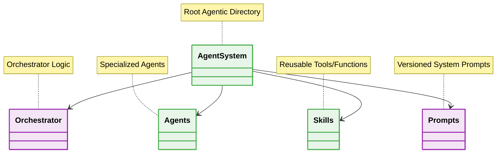

  # 🤖 Agentic Architecture - Folder Structure

---

## ❌ Bad Practice
Lumping all prompts, system instructions, and agent logic into a single file or directory.

## ⚠️ Problem
Monolithic agent codebases prevent reusability of skills, make prompts difficult to version control, and cause context pollution as the system scales.

## ✅ Best Practice
Isolating agents by domain and separating prompts from execution logic.

## 🚀 Solution
A strict folder structure ensures that agents load only the skills and prompts they explicitly need, adhering to the principle of least privilege and optimizing token usage.
