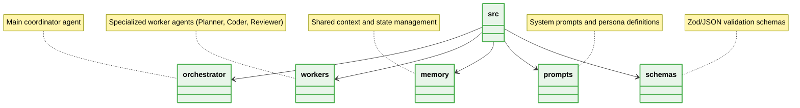

# 📁 Agentic Architecture Folder Structure Best Practices

  **Strict directory blueprints for Multi-Agent Systems.**

---

## 🏗️ Structure Rules

## 📌 Core Constraints
1. **Isolated Prompts:** System prompts MUST be stored in `prompts/` and loaded dynamically.
2. **Validation Layer:** Schemas for agent I/O MUST reside in `schemas/`.
