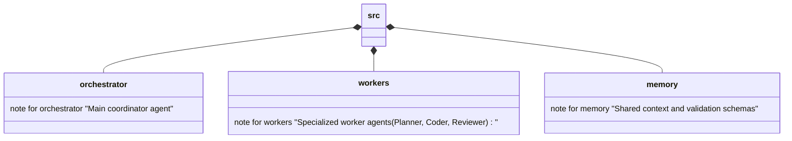

# Agentic Architecture - Folder Structure
## Modular isolation of Prompts, Skills, and Contexts

```mermaid
classDiagram
    class src {
    }
    class orchestrator {
        note for orchestrator "Main coordinator agent"
    }
    class workers {
        note for workers "Specialized worker agents (Planner, Coder, Reviewer)"
    }
    class memory {
        note for memory "Shared context and validation schemas"
    }
    src *-- orchestrator
    src *-- workers
    src *-- memory
    class src:::default
    class orchestrator:::component
    class workers:::component
    class memory:::component
```
