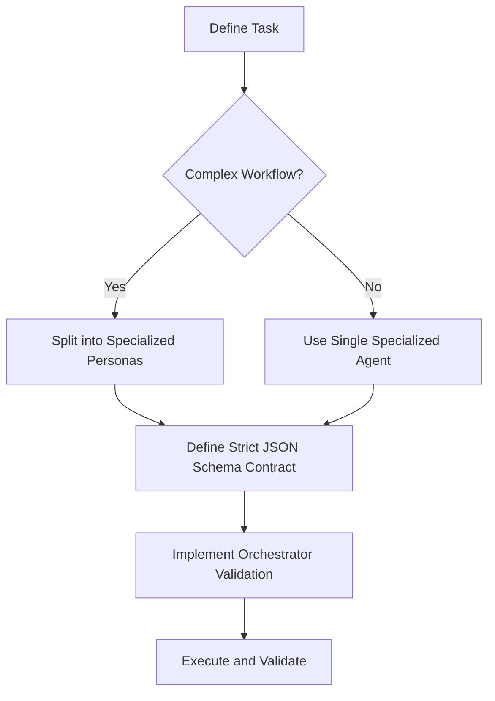

# 🛠️ Agentic Architecture: Implementation Guide Blueprint

> [!NOTE]
> **Internal Routing:** [Agentic Architecture Map](./readme.md)

## Implementation Decision Tree



## 1. Strict Contract Validation

### ❌ Bad Practice
```typescript
class LooseAgent {
    async run(prompt: string): Promise<any> {
        const result = await llm.call(prompt);
        return JSON.parse(result); // Assumes perfect JSON without validation
    }
}
```

### ⚠️ Problem
Using `any` and blindly parsing LLM output guarantees runtime crashes due to hallucinated structure or trailing markdown characters in the response.

### ✅ Best Practice
> [!NOTE]
> **Internal Routing:** [Implementation Guide Rules](./implementation-guide.md)

```typescript
interface ExecutionResult {
    status: 'success' | 'failure';
    data: unknown;
}

class StrictAgent {
    async run(prompt: string): Promise<ExecutionResult> {
        const result = await llm.call(prompt);
        // Implement rigorous validation here (e.g., Zod)
        const parsed = this.validateAndParse(result);
        return { status: 'success', data: parsed };
    }

    private validateAndParse(raw: string): unknown {
        // Validation logic
        return JSON.parse(raw);
    }
}
```

### 🚀 Solution
Inter-agent communication MUST STRICTLY utilize interfaces for payload typing and `unknown` for raw data processing before validation. A deterministic validation layer MUST wrap every LLM call.
