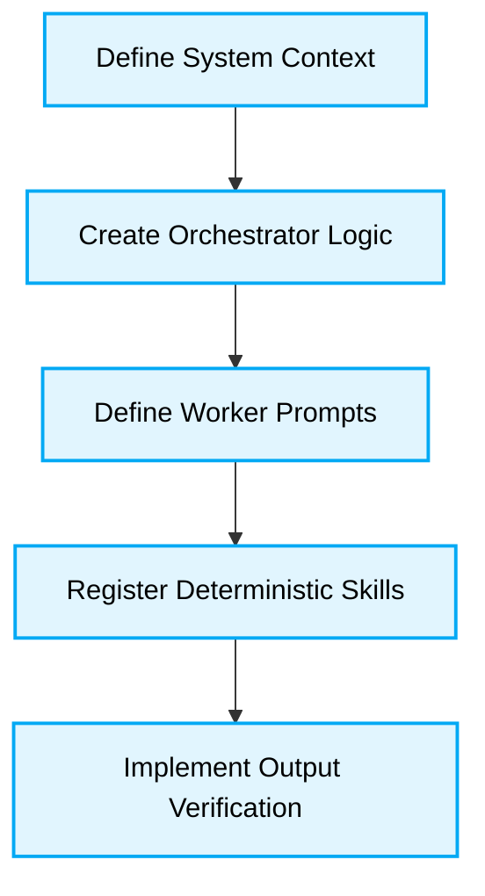

# 🛠️ Agentic Architecture Implementation Guide

## 🗺️ Map of Patterns (Agentic Modules)
- 🏠 **[Back to Agentic Architecture Guidelines](./readme.md)**



## 1. Implementing Output Verification

### ❌ Bad Practice
```typescript
async function processTask(prompt: string) {
  const result = await llm.generate(prompt);
  // Trusting the output blindly
  saveToDatabase(JSON.parse(result));
}
```

### ⚠️ Problem
LLMs, even with strict system prompts, will occasionally output malformed JSON or ignore constraints, causing fatal runtime exceptions (`JSON.parse` errors) or silent data corruption.

### ✅ Best Practice
> [!NOTE]
> **Internal Routing:** For more context, refer back to the [Agentic Architecture Guidelines](./readme.md).

```typescript
import { z } from 'zod';

const OutputSchema = z.object({
  status: z.enum(['success', 'failure']),
  data: z.any()
});

async function processTask(prompt: string) {
  const result = await llm.generate(prompt);

  try {
    const parsed = JSON.parse(result);
    // Deterministic validation
    const validatedData = OutputSchema.parse(parsed);
    saveToDatabase(validatedData);
  } catch (error) {
    // Implement fallback or retry logic here
    throw new Error("Agent output failed schema validation.");
  }
}
```

### 🚀 Solution
Using a runtime validation library (like Zod) creates a deterministic boundary around non-deterministic AI generation. It ensures that the rest of the application never encounters unexpected data structures, significantly boosting system reliability.
