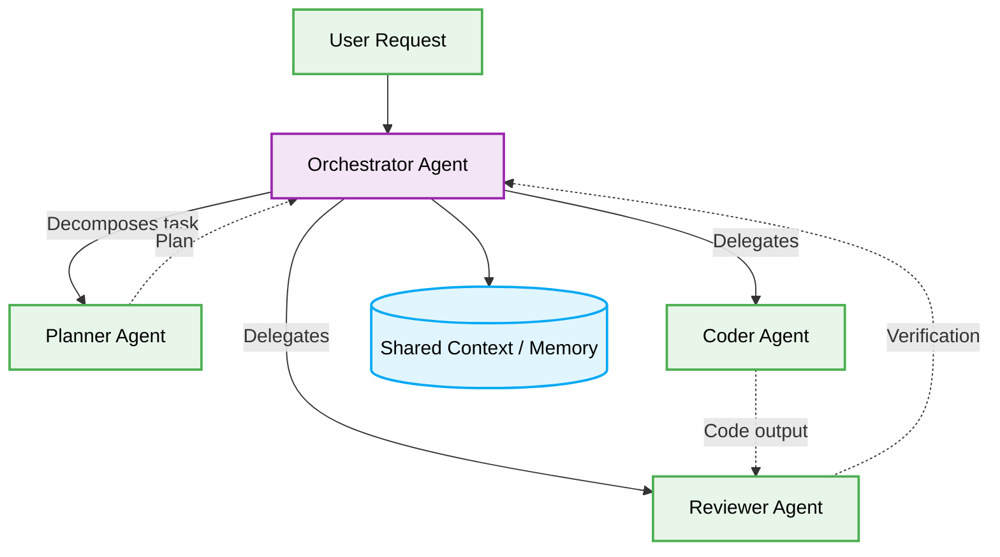

# 🤖 Agentic Architecture (AI Agent Orchestration) Production-Ready Best Practices

# Context & Scope
- **Primary Goal:** Document and execute the best practices for AI Agent Orchestration and Multi-Agent Systems.
- **Target Tooling:** AI Agents and Human Developers.
- **Tech Stack Version:** Agnostic

  

  **Deterministic blueprints for scalable, orchestrated AI agents.**

---
## 🗺️ Map of Patterns (Agentic Modules)

This architecture defines the operational boundaries for multi-agent workflows, specifically optimizing for context windows, token efficiency, and deterministic output.

- 🌊 [**Data Flow:** Orchestrator-to-Worker execution paths.](./data-flow.md)
- 📁 [**Folder Structure:** Modular isolation of Prompts, Skills, and Contexts.](./folder-structure.md)
- ⚖️ [**Trade-offs:** Latency vs. Reasoning depth.](./trade-offs.md)
- 🛠️ [**Implementation Guide:** Rules for defining strict agent personas and constraints.](./implementation-guide.md)

## 🚀 The Core Philosophy

Agentic Architecture emphasizes the decomposition of monolithic tasks into granular, specialized agent workloads managed by a central Orchestrator. This resolves massive context window pollution and isolates functional logic.

> [!IMPORTANT]
> **AI Constraint:** Agents MUST NOT mutate shared global state directly. They must return deterministic structured data (e.g., JSON schema) to the Orchestrator, which strictly validates the payload before persisting it.

---

