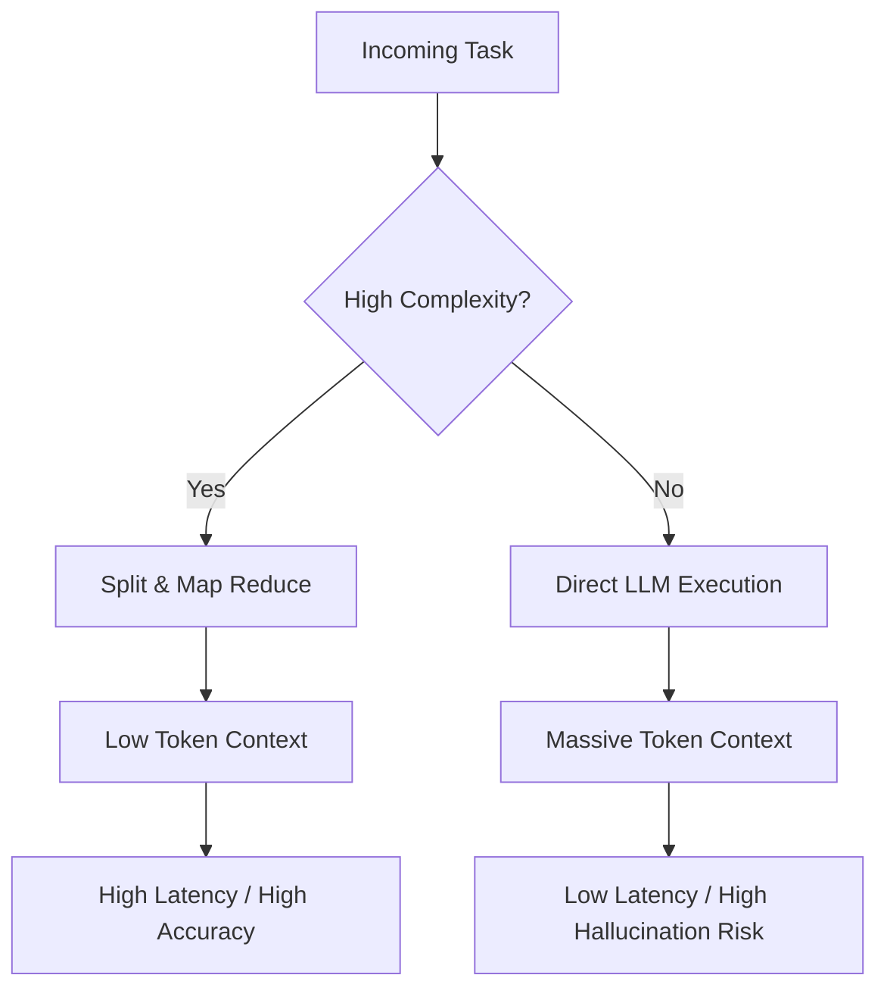

# ⚖️ Agentic Architecture: Trade-offs Blueprint

> [!NOTE]
> **Internal Routing:** [Agentic Architecture Map](./readme.md)

## Context Window vs Performance Trade-off Flow



## Architectural Constraints Comparison

| Metric | Monolithic Agent | Multi-Agent Orchestration |
| :--- | :--- | :--- |
| **Latency** | Low (Single LLM call) | High (Multiple sequential calls) |
| **Reasoning Depth** | Shallow (Context overload) | Deep (Specialized focus) |
| **Token Efficiency** | Poor (Send everything) | Excellent (Targeted context) |
| **Determinism** | Low | High |
| **Cost** | High per call | Moderate (smaller contexts) |

## 1. Latency vs Determinism Tuning

### ❌ Bad Practice
```typescript
// Optimizing purely for speed by removing validation and chunking
async function fastButUnsafeExecution(prompt: string) {
    return await llm.generate(prompt);
}
```

### ⚠️ Problem
Prioritizing latency by bypassing Orchestrator validation leads to unpredictable output states. In an enterprise system, a fast hallucination is exponentially more expensive to fix than a slow, verified action.

### ✅ Best Practice
> [!NOTE]
> **Internal Routing:** [Trade-offs Rules](./trade-offs.md)

```typescript
// Enforcing structural validation over pure speed
async function safeExecution(prompt: string, schema: interfaceSchema): Promise<unknown> {
    const raw = await llm.generate(prompt);
    return Orchestrator.validateStrict(raw, schema);
}
```

### 🚀 Solution
Multi-agent systems MUST STRICTLY accept the latency trade-off in favor of determinism. Execution pipelines MUST enforce schema validation at every boundary, making reliability the primary metric of success.
