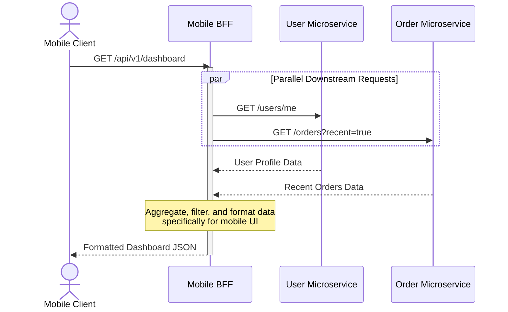
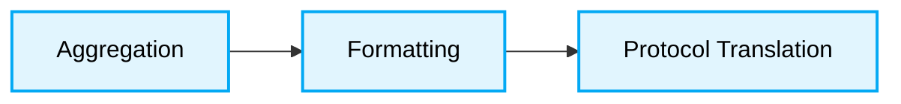

  # 📊 Backend-For-Frontend (BFF) Data Flow

---

## Request Lifecycle

The BFF acts as a dedicated intermediary between a specific client and multiple downstream microservices.

## Core Principles

1. **Aggregation:** The BFF aggregates responses from multiple services to reduce the number of client-side requests.
2. **Formatting:** The BFF formats data precisely according to what the client needs, stripping out unnecessary fields to save bandwidth.
3. **Protocol Translation:** The BFF can translate between client-friendly protocols (e.g., HTTP/REST, GraphQL) and internal service protocols (e.g., gRPC, AMQP).

