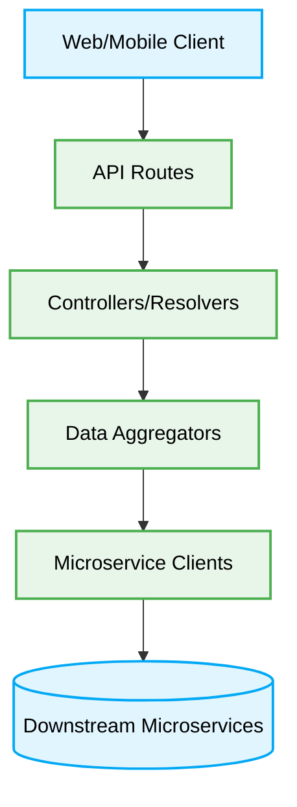
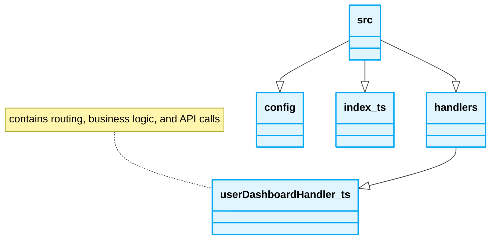
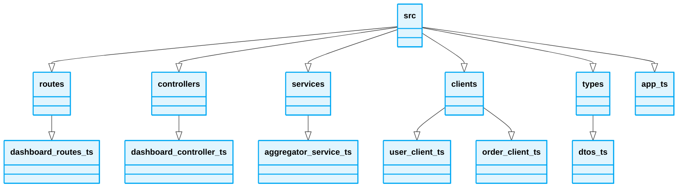

<div align="center">
  # 📁 Backend-For-Frontend (BFF) Folder Structure
</div>

---

## Architecture Diagram & Folder Tree



---

## 1. Directory Blueprint

### ❌ Bad Practice
```text
src/
├── handlers/
│   └── userDashboardHandler.ts (contains routing, business logic, and API calls)
├── config/
└── index.ts
```



### ⚠️ Problem
Placing routing, data aggregation, and downstream API calls in a single handler creates a monolithic structure within the BFF. It makes testing difficult, limits code reuse, and violates the single responsibility principle.

### ✅ Best Practice
```text
src/
├── routes/
│   └── dashboard.routes.ts
├── controllers/
│   └── dashboard.controller.ts
├── services/
│   └── aggregator.service.ts
├── clients/
│   ├── user.client.ts
│   └── order.client.ts
├── types/
│   └── dtos.ts
└── app.ts
```



### 🚀 Solution
Separate responsibilities clearly. `routes` handle HTTP concerns. `controllers` parse requests and format responses. `services` (or aggregators) orchestrate the calls to multiple downstream microservices. `clients` isolate the network logic (HTTP/gRPC) for communicating with downstream microservices. This structure enhances testability and maintainability.
