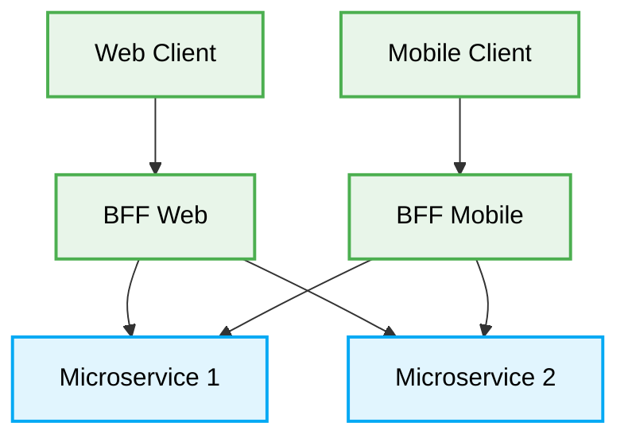

<div align="center">
  # 🏛️ Backend-For-Frontend (BFF) Production-Ready Best Practices
</div>

---

This engineering directive defines the **best practices** for the Backend-For-Frontend (BFF) architecture. This document is designed to ensure maximum scalability, security, and code quality when developing applications that require tailored APIs for different clients (e.g., web, mobile).

# Context & Scope
- **Primary Goal:** Provide strict architectural rules and practical patterns for creating specialized backend services dedicated to specific frontend applications.
- **Description:** A pattern where a separate backend service is created for each specific frontend application or interface type, rather than having a single general-purpose API backend for all clients.

## Map of Patterns
- 📊 [**Data Flow:** Request and Event Lifecycle](./data-flow.md)
- 📁 [**Folder Structure:** Layering logic](./folder-structure.md)
- ⚖️ [**Trade-offs:** Pros, Cons, and System Constraints](./trade-offs.md)
- 🛠️ [**Implementation Guide:** Code patterns and Anti-patterns](./implementation-guide.md)


### Structural Comparison: Backend-for-Frontend (BFF) vs API Gateway

| Feature | Backend-for-Frontend (BFF) | API Gateway |
| :--- | :--- | :--- |
| **Scope** | One per specific client type (Web, Mobile, Desktop) | Single entry point for all clients |
| **Ownership** | Owned by the Frontend team | Owned by a dedicated API or Platform team |
| **Customization** | Highly tailored to client UI needs | Generic, serving broad needs |
| **Complexity** | Multiple BFFs to manage | Single point of failure/bottleneck |





## Core Principles

1. **Client Focus:** Each BFF is built and maintained by the same team that builds the frontend client.
2. **Aggregation:** The BFF orchestrates and aggregates calls to various downstream microservices.
3. **Resilience:** The BFF must gracefully handle failures from downstream services, ensuring a seamless user experience.

---

## 1. Single Universal API for All Clients

### ❌ Bad Practice
```typescript
class UniversalGatewayController {
  @Get('/dashboard')
  async getDashboardData(req: Request) {
    // Attempting to serve Web, iOS, and Android from one endpoint
    const data = await this.dashboardService.fetch();

    if (req.headers['x-client-type'] === 'mobile') {
      // Stripping data for mobile (fragile branching)
      return {
        stats: data.stats,
        // Mobile doesn't need complex graphs
      };
    }

    // Web gets everything, potentially over-fetching
    return data;
  }
}
```

### ⚠️ Problem
Using a single gateway or backend for diverse clients leads to bloated endpoints, complex `if/else` branching for different client needs, and over-fetching or under-fetching of data. Changing the API for a web feature risks breaking the mobile app.

### ✅ Best Practice

> [!NOTE]
> **Internal Routing:** For more context, refer back to the [Architecture Map](../readme.md).

```typescript
// --- Web BFF ---
class WebDashboardController {
  @Get('/dashboard')
  async getDashboardData() {
    // Specifically tailored for Web (includes complex graphs)
    return this.dashboardAggregationService.fetchFullDashboard();
  }
}

// --- Mobile BFF ---
class MobileDashboardController {
  @Get('/dashboard')
  async getDashboardData() {
    // Specifically tailored for Mobile (lightweight, minimal data)
    return this.dashboardAggregationService.fetchMobileOptimizedDashboard();
  }
}
```

### 🚀 Solution
Implement a dedicated Backend-For-Frontend (BFF) for each distinct client experience (e.g., one for Web, one for Mobile). This ensures APIs are optimized for the specific UI, eliminates brittle conditional logic, and allows frontend teams to autonomously evolve their respective backends without blocking each other.
