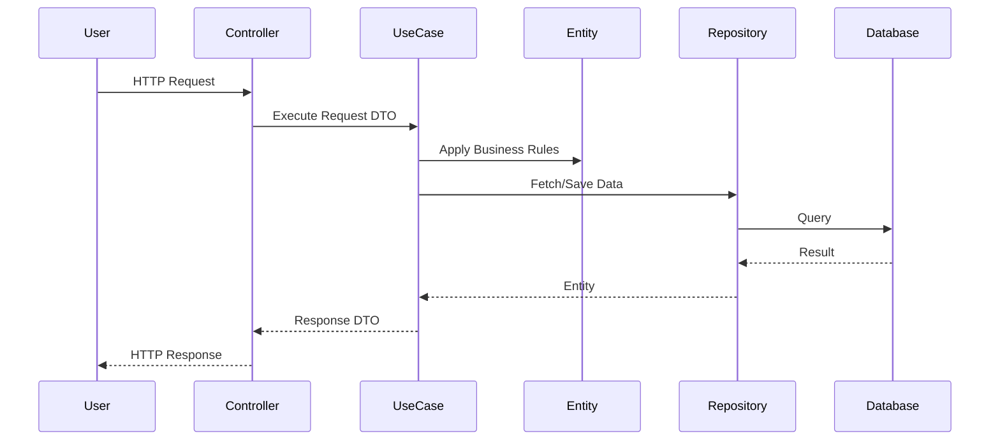

# Clean Architecture - Data Flow

## Request and Event Lifecycle

```mermaid
sequenceDiagram
    participant User
    participant Controller
    participant UseCase
    participant Entity
    participant Repository
    participant Database

    User->>Controller: HTTP Request
    Controller->>UseCase: Execute Request DTO
    UseCase->>Entity: Apply Business Rules
    UseCase->>Repository: Fetch/Save Data
    Repository->>Database: Query
    Database-->>Repository: Result
    Repository-->>UseCase: Entity
    UseCase-->>Controller: Response DTO
    Controller-->>User: HTTP Response
```

### Constraints
- Dependency rule always points inwards towards the domain.
