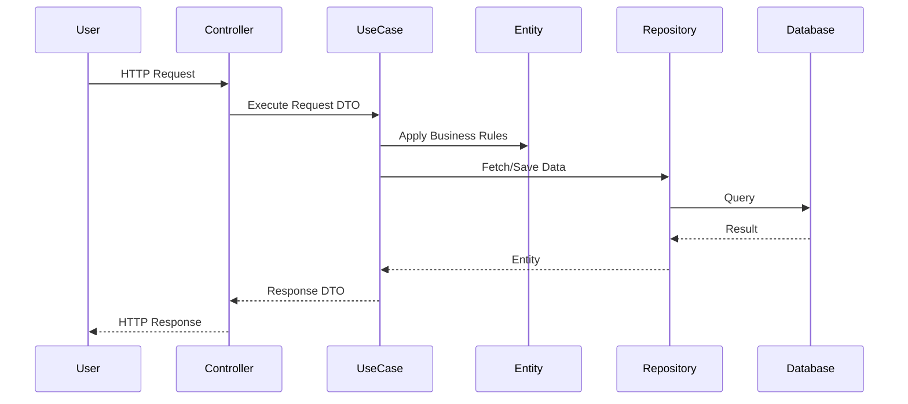

---
description: Vibe coding guidelines and architectural constraints for Clean Architecture within the Architecture domain.
tags: [clean-architecture, architecture, best-practices, architecture]
topic: Clean Architecture
complexity: Architect
last_evolution: 2026-03-29
vibe_coding_ready: true
technology: Clean Architecture
domain: Architecture
level: Senior/Architect
version: Latest
ai_role: Senior Clean Architecture Expert
last_updated: 2026-03-29---# Clean Architecture - Data Flow
## Request and Event Lifecycle

### Constraints
- Dependency rule always points inwards towards the domain.
